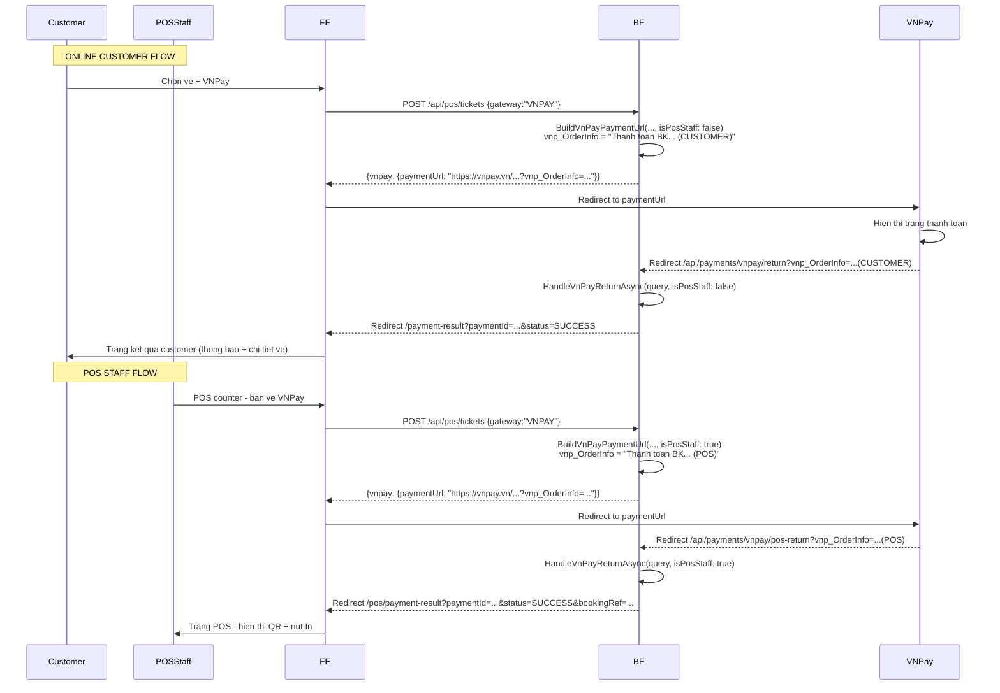

# BE + FE: VNPay return phân biệt Staff vs Customer

## Bối cảnh

VNPay redirect về backend qua `/api/payments/vnpay/return`. Hiện tại cả **online customer** lẫn **POS staff** dùng chung URL redirect (`FrontendReturnUrl` trong config) → trang kết quả chỉ phù hợp cho customer, staff không thấy QR ticket để in.

Backend `/api/payments/vnpay/return` **không có `[Authorize]`** (VNPay redirect không kèm JWT), nên không thể check role từ token.

## Phương án

Dùng `vnp_OrderInfo` (VNPay echo-back parameter) để phân biệt. VNPay sẽ redirect về `/api/payments/vnpay/return?vnp_OrderInfo=...`, backend đọc `vnp_OrderInfo` trong query string để xác định nên redirect về trang nào.

Backend tạo 2 endpoint redirect:

- `/api/payments/vnpay/return` — VNPay standard return (customer), `vnp_OrderInfo` chứa `(CUSTOMER)` → redirect về `FrontendReturnUrl`
- `/api/payments/vnpay/pos-return` — POS VNPay return (staff), `vnp_OrderInfo` chứa `(POS)` → redirect về `PosPaymentResultUrl`

FE có 2 trang kết quả:

- `/payment-result` — trang customer (đã có)
- `/pos/payment-result` — trang POS staff (mới), hiển thị QR + nút in

## Thay đổi phía Backend

### 1. `IPaymentService.BuildVnPayPaymentUrl` — thêm param `isPos`

File: [src/CinemaSystem.Services/Services/Payments/IPaymentService.cs](src/CinemaSystem.Services/Services/Payments/IPaymentService.cs)

Thêm overload:

```csharp
string BuildVnPayPaymentUrl(Payment payment, Booking booking, bool isPosStaff = false);
```

### 2. `PaymentService.BuildVnPayPaymentUrl` — mã hóa role vào `vnp_OrderInfo`

File: [src/CinemaSystem.Services/Services/Payments/PaymentService.cs](src/CinemaSystem.Services/Services/Payments/PaymentService.cs)

Overload mới:

```csharp
public string BuildVnPayPaymentUrl(Payment payment, Booking booking, bool isPosStaff = false)
{
    _vnPayOptions.EnsureConfigured();

    var now = DateTime.UtcNow.AddHours(7);
    var expireDate = booking.ExpiresAt.AddHours(7);
    var orderInfoSuffix = isPosStaff ? " (POS)" : " (CUSTOMER)";
    var orderInfo = $"Thanh toan booking {booking.BookingRef}{orderInfoSuffix}";

    var parameters = new SortedDictionary<string, string>(StringComparer.Ordinal)
    {
        // ... existing fields ...
        ["vnp_OrderInfo"] = orderInfo,
        // ... rest unchanged ...
    };

    // ... hash + return URL ...
    return $"{_vnPayOptions.PaymentUrl}?{query}&vnp_SecureHash={secureHash}";
}
```

Giữ overload cũ (không param) → gọi `BuildVnPayPaymentUrl(payment, booking, false)` bên trong.

### 3. Thêm `PosPaymentResultUrl` vào config

File: [src/CinemaSystem.API/appsettings.json](src/CinemaSystem.API/appsettings.json)

Thêm vào section `VnPay`:

```json
"PosPaymentResultUrl": "https://frontend-pos-domain/pos/payment-result"
```

> FE: tạo route `/pos/payment-result` (xem phần FE bên dưới)

### 4. Thêm endpoint `/api/payments/vnpay/pos-return`

File: [src/CinemaSystem.API/Controllers/PaymentsController.cs](src/CinemaSystem.API/Controllers/PaymentsController.cs)

Endpoint mới:

```csharp
[HttpGet("vnpay/pos-return")]
[ProducesResponseType(StatusCodes.Status302Found)]
public async Task<IActionResult> HandleVnPayPosReturn(CancellationToken cancellationToken)
{
    var query = Request.Query.ToDictionary(
        item => item.Key,
        item => item.Value.ToString(),
        StringComparer.OrdinalIgnoreCase);

    logger.LogDebug("VNPay POS return received - vnp_OrderInfo={OrderInfo}",
        query.TryGetValue("vnp_OrderInfo", out var oi) ? oi : "NULL");

    var response = await paymentService.HandleVnPayReturnAsync(query, cancellationToken);

    if (!string.IsNullOrWhiteSpace(response.RedirectUrl))
    {
        return Redirect(response.RedirectUrl);
    }

    return Ok(ApiResponse<PaymentResponseDto>.Success(
        response,
        "VNPay POS return handled successfully."));
}
```

Logic `HandleVnPayReturnAsync` giữ nguyên — chỉ đổi redirect URL bên trong `BuildFrontendReturnUrl`.

### 5. Sửa `PaymentService.BuildFrontendReturnUrl` — đọc `vnp_OrderInfo` từ query

**Lưu ý quan trọng**: `HandleVnPayReturnAsync` nhận `IReadOnlyDictionary<string, string> query` nhưng **không lưu `vnp_OrderInfo`** vào `Payment` model. VNPay sẽ echo `vnp_OrderInfo` khi redirect về, nhưng `HandleVnPayReturnAsync` không nhận được query string lúc redirect.

**Giải pháp**: Truyền `isPosStaff` flag vào `HandleVnPayReturnAsync`:

```csharp
// IPaymentService.cs
Task<PaymentResponseDto> HandleVnPayReturnAsync(
    IReadOnlyDictionary<string, string> query,
    bool isPosStaff,         // NEW: true = POS staff redirect
    CancellationToken ct = default);

// PaymentService.cs
public async Task<PaymentResponseDto> HandleVnPayReturnAsync(
    IReadOnlyDictionary<string, string> query,
    bool isPosStaff = false,  // default = false (customer)
    CancellationToken cancellationToken = default)
{
    // ... existing validation + payment processing ...

    // Thay vì gọi BuildFrontendReturnUrl() luôn,
    // chọn URL dựa trên isPosStaff:
    var separator = _vnPayOptions.FrontendReturnUrl.Contains('?') ? "&" : "?";
    var redirectBase = isPosStaff
        ? _vnPayOptions.PosPaymentResultUrl
        : _vnPayOptions.FrontendReturnUrl;

    return ToResponse(
        payment,
        booking,
        redirectUrl: $"{redirectBase}{separator}paymentId={payment.Id}&status={payment.Status}&bookingRef={booking.BookingRef}");
}
```

### 6. Update `PaymentsController` — truyền `isPosStaff` vào handler

```csharp
// Existing customer return
public async Task<IActionResult> HandleVnPayReturn(CancellationToken cancellationToken)
{
    var query = Request.Query.ToDictionary(...);
    var response = await paymentService.HandleVnPayReturnAsync(query, isPosStaff: false, cancellationToken);
    // ...
}

// NEW: POS staff return
public async Task<IActionResult> HandleVnPayPosReturn(CancellationToken cancellationToken)
{
    var query = Request.Query.ToDictionary(...);
    var response = await paymentService.HandleVnPayReturnAsync(query, isPosStaff: true, cancellationToken);
    // ...
}
```

## Thay đổi phía Frontend

### 7. Tạo route mới `/pos/payment-result`

Trang POS staff payment result (sau khi VNPay redirect về).

Nhận query params:

- `paymentId` — để fetch booking + tickets từ API
- `status` — SUCCESS / FAILED để hiển thị message phù hợp
- `bookingRef` — để hiển thị

**Logic trang**:

```
1. Nếu status = SUCCESS:
   a. Gọi GET /api/pos/tickets/by-ref/{bookingRef}
   b. Nếu booking CONFIRMED → hiển thị danh sách ticket + QR + nút "In"
   c. Nếu booking EXPIRED/CANCELLED → hiển thị "Thanh toan that bai / da huy"
2. Nếu status = FAILED:
   a. Hiển thị "Thanh toan that bai" + bookingRef
3. Luôn có nút "Quay ve POS" → redirect về trang POS counter
```

**Component POS Payment Result**:

```typescript
// pages/pos/PaymentResultPage.tsx
export function PosPaymentResultPage() {
  const { paymentId, status, bookingRef } = useSearchParams();

  if (status === 'SUCCESS') {
    const { data } = useQuery({
      queryKey: ['pos-booking', bookingRef],
      queryFn: () => posApi.getBookingByRef(bookingRef!),
    });

    if (data?.bookingStatus === 'CONFIRMED') {
      return (
        <div>
          <h2>Thanh toan thanh cong!</h2>
          <p>Ma ve: {data.bookingRef}</p>
          <p>Phim: {data.movieTitle}</p>
          <p>Suat: {formatShowtime(data.showtimeStart)}</p>
          {data.tickets.map(ticket => (
            <div key={ticket.ticketId}>
              <p>Ghe: {ticket.seatLabel}</p>
              <QRCode value={ticket.token} />   {/* render tu token */}
              <button onClick={() => printTicket(ticket)}>In ve</button>
            </div>
          ))}
          <button onClick={() => navigate('/pos')}>Quay ve POS Counter</button>
        </div>
      );
    }

    return (
      <div>
        <h2>Thanh toan khong thanh cong</h2>
        <p>Ma ve: {bookingRef}</p>
        <p>Trang thai: {data?.bookingStatus ?? 'Khong ro'}</p>
        <button onClick={() => navigate('/pos')}>Quay ve POS Counter</button>
      </div>
    );
  }

  return (
    <div>
      <h2>Thanh toan that bai</h2>
      <p>Ma ve: {bookingRef}</p>
      <button onClick={() => navigate('/pos')}>Quay ve POS Counter</button>
    </div>
  );
}
```

### 8. Cập nhật `POST /api/pos/tickets` — nhánh VNPay dùng `pos-return`

File: [src/CinemaSystem.Services/Services/Pos/PosBookingService.cs](src/CinemaSystem.Services/Services/Pos/PosBookingService.cs)

Thêm `bool isPosStaff = true` vào `BuildPaymentUrlForBookingAsync`:

```csharp
private async Task<string> BuildPaymentUrlForBookingAsync(
    CreateBookingResponseDto bookingResponse,
    bool isPosStaff,    // NEW
    CancellationToken cancellationToken)
{
    // ...
    return isPosStaff
        ? _paymentService.BuildVnPayPaymentUrl(payment, booking, isPosStaff: true)
        : _paymentService.BuildVnPayPaymentUrl(payment, booking, isPosStaff: false);
}
```

Gọi với `isPosStaff: true`:

```csharp
var paymentUrl = await BuildPaymentUrlForBookingAsync(bookingResponse, isPosStaff: true, cancellationToken);
```

### 9. Cập nhật `appsettings.json` — thêm `PosPaymentResultUrl`

File: [src/CinemaSystem.API/appsettings.json](src/CinemaSystem.API/appsettings.json)

```json
{
  "VnPay": {
    "TmnCode": "...",
    "HashSecret": "...",
    "PaymentUrl": "https://sandbox.vnpayment.vn/...",
    "ReturnUrl": "https://api-domain/api/payments/vnpay/return",
    "FrontendReturnUrl": "https://frontend-customer-domain/payment-result",
    "PosPaymentResultUrl": "https://frontend-pos-domain/pos/payment-result"
  }
}
```

## File cần sửa / tạo

**Backend:**

- [src/CinemaSystem.Services/Services/Payments/IPaymentService.cs](src/CinemaSystem.Services/Services/Payments/IPaymentService.cs) — thêm param `isPosStaff` vào `BuildVnPayPaymentUrl` + `HandleVnPayReturnAsync`
- [src/CinemaSystem.Services/Services/Payments/PaymentService.cs](src/CinemaSystem.Services/Services/Payments/PaymentService.cs) — implement overload, sửa `BuildFrontendReturnUrl` thành `BuildReturnUrl`, chọn URL theo flag
- [src/CinemaSystem.API/Controllers/PaymentsController.cs](src/CinemaSystem.API/Controllers/PaymentsController.cs) — thêm endpoint `GET vnpay/pos-return`, truyền `isPosStaff` vào handler
- [src/CinemaSystem.Services/Services/Pos/PosBookingService.cs](src/CinemaSystem.Services/Services/Pos/PosBookingService.cs) — truyền `isPosStaff: true` khi build VNPay URL
- [src/CinemaSystem.API/appsettings.json](src/CinemaSystem.API/appsettings.json) — thêm `PosPaymentResultUrl`

**Frontend:**

- Tạo route mới `/pos/payment-result`
- Component `PosPaymentResultPage` như trên

## Flow đầy đủ sau khi sửa




## Lưu ý

- Không thay đổi flow **CASH 2-step** (đã làm ở plan trước).
- Không thay đổi online customer booking (họ không đi qua PosBookingService).
- VNPay IPN (`/api/payments/vnpay/ipn`) vẫn dùng `HandleVnPayReturnAsync(query, isPosStaff: false)` — IPN chỉ dùng cho customer (backend webhook).
- FE cần deploy route `/pos/payment-result` để nhận redirect từ BE.
