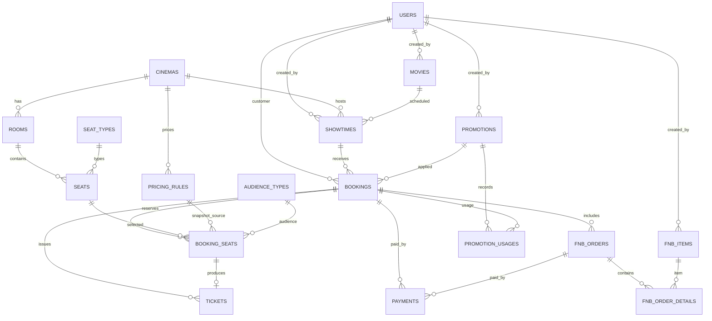
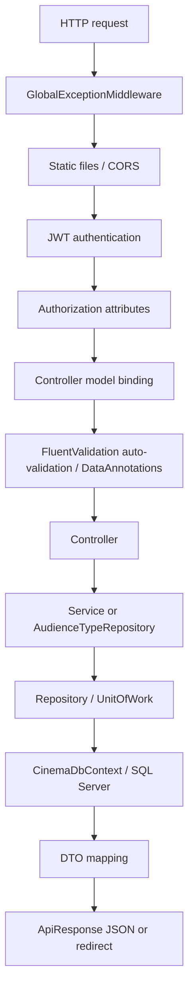
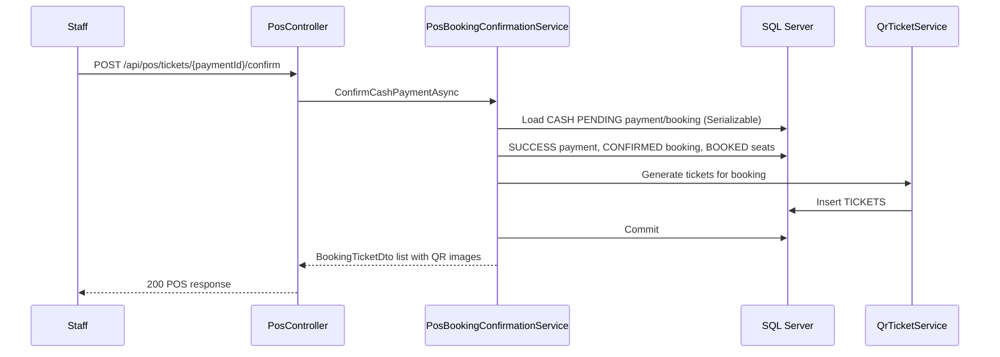

# Cinema Management System Documentation

> Phạm vi: tài liệu này được tạo từ mã nguồn đang có trong solution `CinemaSystem.slnx`, các project/phần mã hỗ trợ nằm trong repository, cùng các SQL script. Nội dung chỉ mô tả hành vi nhìn thấy trong source; không suy diễn về những chức năng không được triển khai. Giá trị bí mật trong `appsettings*.json` và utility scripts được cố ý không lặp lại.

---

## Table of Contents

1. [Project Overview](#1-project-overview)
2. [Project Structure](#2-project-structure)
3. [Folder Explanation](#3-folder-explanation)
4. [Dependency Injection](#4-dependency-injection)
5. [Authentication Flow](#5-authentication-flow)
6. [API Documentation](#6-api-documentation)
7. [Business Flow](#7-business-flow)
8. [Database Flow](#8-database-flow)
9. [Package Dependency](#9-package-dependency)
10. [Request Lifecycle](#10-request-lifecycle)
11. [Sequence Diagram](#11-sequence-diagram)
12. [Class Relationship](#12-class-relationship)
13. [Important Classes](#13-important-classes)
14. [Error Handling](#14-error-handling)
15. [Security](#15-security)
16. [Summary](#16-summary)

---

## 1. Project Overview

`CinemaSystem` là backend Web API cho vận hành rạp chiếu phim. Mã hiện có quản lý người dùng/xác thực, rạp/phòng/ghế, phim/suất chiếu, bảng giá và đối tượng khán giả, đặt vé trực tuyến và tại quầy (POS), thanh toán VNPay, F&B, khuyến mãi, QR ticket/check-in, báo cáo và upload ảnh.

| Hạng mục | Bằng chứng trong source |
|---|---|
| Framework/runtime | ASP.NET Core Web API, `net10.0` (`CinemaSystem.API.csproj`) |
| Database | SQL Server qua `Microsoft.EntityFrameworkCore.SqlServer`; context là `CinemaDbContext` |
| ORM | Entity Framework Core 9.0.2; mapping fluent trong `CinemaDbContext.OnModelCreating` |
| API/OpenAPI | Controllers, `AddOpenApi`, Swashbuckle/Swagger (`/swagger` ở Development hoặc Production) |
| Authentication | JWT Bearer + refresh token có lưu hash; Google ID token qua `Google.Apis.Auth` |
| Password | `BCrypt.Net-Next` (`BCrypt.HashPassword`, `BCrypt.Verify`) |
| Validation | FluentValidation auto-validation và DataAnnotations trên nhiều DTO |
| Mapping | AutoMapper 16.2.0; `PromotionMappingProfile`, `AdminUserMappingProfile` |
| QR | QRCoder; token QR ngẫu nhiên, ảnh PNG Base64/data URL |
| Payment | VNPay URL/callback, chữ ký HMAC-SHA512 |
| Upload | CloudinaryDotNet |
| Email | `SmtpClient` qua `EmailService` |
| Background work | `BookingExpiryBackgroundService`, `ShowtimeCompletionBackgroundService` |

`ApiResponse<T>` là wrapper chủ đạo: `isSuccess`, `message`, `data`, `errors`. Danh sách phân trang dùng `PagedResult<T>` gồm `items`, `page`, `pageSize`, `totalCount`, `totalPages`.

---

## 2. Project Structure

Solution chỉ tham chiếu bốn project dưới `src/`.

```text
CinemaSystem.slnx
└── src/
    ├── CinemaSystem.API       Web/API host, controllers, validators, middleware
    ├── CinemaSystem.Common    DTO, constants, enums, helpers, exceptions, settings
    ├── CinemaSystem.DAL       EF Core models/context, repositories, UnitOfWork
    └── CinemaSystem.Services  business services, interfaces, mapping, integrations
```

### `CinemaSystem.API`

- `Program.cs` cấu hình CORS, controllers, FluentValidation, AutoMapper, DI, JWT, OpenAPI/Swagger và request pipeline.
- `Controllers/` có 20 controller, công bố toàn bộ 90 endpoint ở phần API.
- `Validators/` là FluentValidation cho auth, booking, cinema, room/seat, showtime, promotion, pricing, POS, QR, payment, F&B và admin user.
- `Middleware/GlobalExceptionMiddleware.cs` chuyển exception thành `ApiResponse` JSON.
- `Services/EmailService.cs` triển khai `IEmailService` bằng SMTP.
- `Services/BackgroundJobs/BookingExpiryBackgroundService.cs` là background worker cho booking hết hạn.
- `DTOs/Uploads/UploadImageRequest.cs` là DTO form-data ở API layer.
- `appsettings.json` khai báo connection/JWT/Google/Cloudinary/SMTP/App; `appsettings.Development.json` chứa section VNPay. Tài liệu không lặp lại secret.

### `CinemaSystem.Services`

- `Services/` chứa interface và implementation nghiệp vụ theo module: `Auth`, `Bookings`, `Cinemas`, `Rooms`, `Showtimes`, `Movies`, `PricingRules`, `Promotions`, `Payments`, `Fnb`, `FnbPayments`, `Pos`, `QrTickets`, `Reports`, `AdminUsers`, `Uploads`.
- `Mapping/` đăng ký AutoMapper profile cho promotion và admin user.
- `ShowtimeCompletionBackgroundService` đặt tại `Services/Showtimes` nhưng được host API đăng ký bằng `AddHostedService`.
- Project tham chiếu Common và DAL, đồng thời dùng BCrypt, Google Auth, QRCoder, JWT và Cloudinary.

### `CinemaSystem.DAL`

- `Models/CinemaDbContext.cs` cung cấp 26 `DbSet`, mapping table/cột/index/FK, và SQL Server provider.
- `Models/` chứa EF entity scaffolded: User, booking/ticket/payment, cinema/room/seat, showtime/movie, F&B, pricing/promotion và entity phụ trợ.
- `Interfaces/` định nghĩa repository contracts và `IUnitOfWork`.
- `Repository/` triển khai repository bằng LINQ/EF Core; không có raw SQL trong application repositories.
- `Infrastructure/UnitOfWork.cs` mở transaction SQL Server ở isolation level `Serializable`; `CommitTransactionAsync` gọi `SaveChangesAsync` rồi commit.

### `CinemaSystem.Common`

- `DTOs/` là contract request/response dùng chung.
- `Constants/` tập trung message, pricing defaults, trạng thái ticket/check-in, time conversion và upload folders.
- `Enums/` có `UserRole`, `RoomTypeKind`, `TimeSlotKind`, trạng thái kết quả xoá.
- `Helpers/` gồm sinh `BookingRef`, QR token và đổi legacy room/time slot sang id pricing.
- `Exceptions/` gồm `BusinessConflictException`, `ForbiddenAccessException`, `CloudinaryOperationException`.
- `Services/IEmailService.cs` là abstraction email; `Settings/CloudinarySettings.cs` binding cấu hình Cloudinary.

### Package inventory

| Project | Package/framework reference trong `.csproj` |
|---|---|
| `CinemaSystem.API` | AutoMapper 16.2.0; CloudinaryDotNet 1.29.2; Microsoft.AspNetCore.OpenApi 10.0.8; Microsoft.EntityFrameworkCore.Design 9.0.2 (private); Swashbuckle.AspNetCore 10.2.1; Microsoft.AspNetCore.Authentication.JwtBearer 10.0.8; FluentValidation.AspNetCore 11.3.1; FluentValidation.DependencyInjectionExtensions 11.11.0. |
| `CinemaSystem.Services` | AutoMapper 16.2.0; BCrypt.Net-Next 4.0.2; CloudinaryDotNet 1.29.2; Google.Apis.Auth 1.75.0; QRCoder 1.8.0; System.IdentityModel.Tokens.Jwt 6.35.0; framework reference `Microsoft.AspNetCore.App`. |
| `CinemaSystem.DAL` | Microsoft.EntityFrameworkCore.Design/SqlServer/Tools 9.0.2; Microsoft.Extensions.Configuration 9.0.2; Microsoft.Extensions.Configuration.Json 9.0.2. |
| `CinemaSystem.Common` | Không có `PackageReference`. |
| `scripts/SeedUsers` | BCrypt.Net-Next 4.0.2; Microsoft.EntityFrameworkCore.SqlServer 9.0.2; project reference tới DAL. |
| `tools/DbCheck`, `probe` | Microsoft.Data.SqlClient 6.1.4. |
| `tools/HashPw` | BCrypt.Net-Next 4.0.3. |

### Thành phần ngoài solution

| Vị trí | Vai trò thực tế |
|---|---|
| `src/Dockerfile` | Build/publish `CinemaSystem.API` bằng SDK/runtime .NET 10 rồi chạy `CinemaSystem.API.dll`. |
| `src/CinemaSystem.API/CinemaSystem.API.http` | Request mẫu cho API Movies. File còn có một request `POST /api/movies/{id}/poster`, nhưng source không có action/controller route tương ứng; vì vậy endpoint đó không nằm trong API thực tế ở phần 6. |
| `src/CinemaSystem.API/test-google.html` | Trang tĩnh thử Google Identity Services, in ID token ra browser console; không phải API endpoint. |
| `*/Properties/launchSettings.json` | Launch profile local; API profile HTTP/HTTPS mở Swagger. |
| `scripts/migrations/` | SQL migration up/down cho `PRICING_RULES` từ string room/time type sang integer ID; README nói project chưa dùng EF Core migrations. |
| `scripts/Database/` | SQL fix cho payment/booking/QR ticket và script seed demo idempotent. |
| `scripts/SeedUsers/` | Console tool EF Core tạo tối đa 1.000 test user `testuser####@cinema.test` còn thiếu. |
| `scripts/test-room-seat-showtime.ps1` | Smoke test REST + SQL setup cho room/seat/showtime. |
| `tools/HashPw/` | Console tool tạo BCrypt hash mẫu. |
| `tools/DbCheck/`, `probe/`, `tools/peek-data.ps1` | Utility/probe trực tiếp SQL Server để kiểm tra hoặc chèn dữ liệu chẩn đoán; không được solution tham chiếu. |
| `test-hash.csx`, `test-hash.ps1` | So sánh HMAC-SHA256 và HMAC-SHA512 với dữ liệu VNPay mẫu. |
| `docs/`, `ARCHITECTURE_AND_WORKFLOW.*`, `README.md`, `DESIGN_RULES.md` | Tài liệu sẵn có, không phải runtime source. |
| `.github/`, `.agents/`, `.cursor/`, `.vs/`, `artifacts/`, `node_modules/` | Metadata/công cụ/build dependency hiện diện tại root, không phải assembly trong solution. |

---

## 3. Folder Explanation

| Folder | Nhiệm vụ |
|---|---|
| `API/Controllers` | Nhận HTTP request, lấy claim khi cần, gọi service/repository, chọn mã HTTP. `AudienceTypesController` gọi repository trực tiếp. |
| `API/Validators` | FluentValidation auto-validation trước controller đối với DTO đã có validator đăng ký. |
| `API/Middleware` | Bắt exception ở đầu pipeline. |
| `API/Services` | SMTP email và background job booking expiry. |
| `Common/DTOs` | JSON request/response; cũng là nguồn DataAnnotations. |
| `Common/Constants` | Message và các hằng trạng thái/default, không phải localization engine. |
| `Common/Helpers` | `BookingRefGenerator`, `QrTokenGenerator`, `PricingKindMapper`. |
| `DAL/Models` | EF entity và navigation properties. |
| `DAL/Repository` | Query/Include/track entity và thao tác add/update/delete qua `CinemaDbContext`. |
| `DAL/Interfaces` | Nút liên kết service–repository; repository tách truy cập data khỏi service. |
| `DAL/Infrastructure` | Transaction boundary `UnitOfWork`. |
| `Services/Services` | Nghiệp vụ, authorization ownership ở một số module, business validation, orchestration transaction/integration. |
| `Services/Mapping` | AutoMapper entity–DTO profile. |
| `scripts/Database` | DDL/DML sửa schema và seed data; cần chạy thủ công. |
| `scripts/migrations` | Migration SQL thủ công, có rollback. |
| `tools`, `probe` | Công cụ phát triển/diagnostic, không phải endpoint production. |

### FluentValidation thực tế

Các rule đã đăng ký từ assembly chứa `RegisterRequestValidator`:

- Auth: đăng ký yêu cầu tên, email đúng định dạng, password tối thiểu 8, confirm khớp; login yêu cầu email/password; Google `idToken` không rỗng; refresh token không rỗng; verify token không rỗng; forgot password email hợp lệ; reset token + password tối thiểu 8 + confirm khớp.
- Booking/POS/payment: booking cần `ShowtimeId`, `AudienceTypeId`, ít nhất một seat và `PromotionCode` tối đa 50 nếu có; POS cần showtime, audience, seat list không rỗng, gateway CASH/VNPAY; payment cần booking ID và gateway trống hoặc VNPAY.
- Cinema/F&B: cinema cần name/address/city/status hợp lệ, giới hạn name/city/phone; F&B item cần name, type COMBO/FOOD/DRINK, giá dương, optional URL HTTP(S), public ID và status ACTIVE/INACTIVE đúng giới hạn.
- Room/seat: room validator kiểm tra cinemaId/name/roomType không rỗng. Seat row là đúng một ký tự chữ, cột > 0, seat type không rỗng. Layout: rows 1–26, seatsPerRow 1–50, default type; override có hàng/cột hợp lệ, status ACTIVE/DISABLED, khoảng row/column không vượt layout.
- Showtime: create yêu cầu movie/room/start không quá khứ; update kiểm tra ID không empty, end > start nếu cùng cung cấp, time slot, language, và chỉ cho phép gửi manual status `CANCELLED`.
- Promotion: create/update yêu cầu promo/name, discount type PERCENTAGE/FIXED_AMOUNT/AMOUNT, giá trị dương (percentage ≤100), min order ≥0 nếu có, `ValidFrom <= ValidTo`, usage limit dương nếu có; validate yêu cầu code và booking amount dương.
- Pricing/QR/admin: update pricing base/multiplier dương; QR token 16–128 ký tự; check-in history page 1–100/pageSize 1–100/from ≤ to; admin kiểm role/status/page, profile name/phone/avatar URL, role và lock days 1–365.

DataAnnotations trong Common bổ sung validation model cho nhiều DTO: giới hạn paging, enum-like allowed values, range, required, URL, date fields và F&B order item quantity 1–100.

---

## 4. Dependency Injection

Mọi registration dưới đây được thực hiện tại `Program.cs`. `AddDbContext<CinemaDbContext>` mặc định là scoped; các repository/service trừ `ICloudinaryService` đều được đăng ký scoped. `ICloudinaryService -> CloudinaryService` là singleton. Hai hosted service do host quản lý; mỗi worker tự tạo service scope.

```text
HTTP Controller
  ↓ interface service (scoped)
Service implementation
  ↓ repository interfaces / UnitOfWork / external abstraction
Repository (scoped)
  ↓
CinemaDbContext (scoped)
  ↓
SQL Server
```

| Controller/module | Injection chain thực tế |
|---|---|
| `AuthController` | `IAuthService -> AuthService -> IUserRepository(UserResponsitory), IRefreshTokenRepository, IEmailVerificationTokenRepository, IPasswordResetTokenRepository, IJwtService(JwtService), IEmailService(EmailService), IConfiguration`. |
| `BookingsController` | `IBookingService -> BookingService -> IBookingRepository, IShowtimeRepository, ISeatRepository, IPricingRuleRepository, IAudienceTypeRepository, IPaymentRepository, IPromotionService, IFnbItemRepository, IFnbOrderRepository, IUnitOfWork, CinemaDbContext`. |
| `PaymentsController` | `IPaymentService -> PaymentService -> IBookingRepository, IPaymentRepository, IQrTicketService, IPromotionService, IUnitOfWork`. |
| `PromotionsController` | `IPromotionService -> PromotionService -> IPromotionRepository, IPromotionUsageRepository, IBookingRepository, IUnitOfWork, IMapper`. |
| `QrTicketsController` / `CheckInController` | `IQrTicketService -> QrTicketService -> IQrTicketRepository, IBookingRepository, IUnitOfWork`; CheckIn còn inject `IFnbOrderService`. |
| Cinema/room/seat/showtime | `ICinemaService -> CinemaService -> ICinemaRepository, IPricingRuleService, IUnitOfWork`; `IRoomService -> RoomService -> ICinemaRepository, IRoomRepository, ISeatRepository`; `ISeatService -> SeatService -> IRoomRepository, ISeatRepository, ISeatTypeRepository`; `IShowtimeService -> ShowtimeService -> IMovieRepository, IRoomRepository, IShowtimeRepository`. |
| Movie/F&B | `IMovieService -> MovieService -> IMovieRepository, ICloudinaryService`; `IFnbItemService -> FnbItemService -> IFnbItemRepository, ICloudinaryService`; `IFnbOrderService -> FnbOrderService -> IFnbOrderRepository, IFnbOrderDetailRepository, IFnbItemRepository, IBookingRepository, IPaymentRepository, IUnitOfWork, CinemaDbContext`. |
| Pricing | `IPricingRuleService -> PricingRuleService -> ICinemaRepository, IPricingRuleRepository`; `ITicketPricingService -> TicketPricingService -> IShowtimeRepository, ISeatRepository, IAudienceTypeRepository, IPricingRuleRepository`. |
| POS/F&B payment | `IPosBookingService -> PosBookingService -> IBookingService, IPaymentService`; `IPosBookingConfirmationService -> PosBookingConfirmationService -> IPaymentRepository, IBookingRepository, IQrTicketService, IPromotionService, IUnitOfWork`; `IFnbPaymentService -> FnbPaymentService -> IFnbOrderRepository, IPaymentRepository, IUnitOfWork`. |
| Admin/report/upload | `IAdminUserService -> AdminUserService -> IAdminUserRepository, IMapper`; `IReportService -> ReportService -> IReportRepository`; `UploadsController -> ICloudinaryService`. |
| Audience type | `AudienceTypesController -> IAudienceTypeRepository` trực tiếp, không qua service. |

### AutoMapper

- `PromotionMappingProfile`: map `Promotion <-> PromotionResponse`; map create/update request sang entity, ignore IDs, creator, created time và navigation; trim/uppercase code/type; `PromotionUsage -> PromotionUsageResponse` lấy code/name từ navigation.
- `AdminUserMappingProfile`: map `User -> UserResponseDto/UserDetailResponseDto`; `UpdateUserRequestDto -> User` chỉ map `FullName`, `Phone`, `AvatarUrl` (trim/null normalize), ignore credential, role/status, provider và navigations.

---

## 5. Authentication Flow

### Register and verify email

```mermaid
sequenceDiagram
    participant C as Client
    participant AC as AuthController
    participant AS as AuthService
    participant U as USERS
    participant VT as EMAIL_VERIFICATION_TOKENS
    participant SMTP as SMTP server

    C->>AC: POST /api/auth/register
    AC->>AS: RegisterAsync(request, clientIp)
    AS->>U: Find by email; INSERT User
    AS->>VT: INSERT SHA-256 token hash, expires +1 minute
    AS->>SMTP: Send verification link with raw token
    AS-->>AC: RegisterResponseDto
    AC-->>C: 201 ApiResponse
```

`AuthService.RegisterAsync` trim email/name, từ chối email đã tồn tại, tạo `User` role `Customer`, status `ACTIVE`, `IsEmailVerified=false`, BCrypt hash password. Raw verification token gồm 64 random bytes, chỉ SHA-256 hash được lưu. Lifetime thực tế là hằng `EmailVerificationLifetimeMinutes = 1`. `VerifyEmailAsync` tìm hash, từ chối thiếu/không tồn tại/đã dùng/hết hạn; sau đó cập nhật user verified và token verified/verified time/IP. GET verify luôn redirect `RedirectUrl`; POST trả body result.

`ResendVerificationAsync` chỉ dành cho user có tồn tại, chưa verified; invalidates các token chưa verified trước, tạo token 1 phút và gửi lại email.

### Local login, JWT và refresh rotation

```mermaid
sequenceDiagram
    participant C as Client
    participant AS as AuthService
    participant U as USERS
    participant RT as REFRESH_TOKENS

    C->>AS: LoginAsync(email,password)
    AS->>U: GetByEmail
    AS->>AS: Check ACTIVE + verified + BCrypt.Verify
    AS->>RT: RevokeAllUserTokensAsync
    AS->>AS: Generate JWT + random refresh token
    AS->>RT: Store SHA-256(refresh token)
    AS-->>C: accessToken + raw refreshToken
    C->>AS: RefreshTokenAsync(raw refresh token)
    AS->>RT: GetByHash
    AS->>RT: Revoke old; create replacement hash
    AS-->>C: rotated token pair
```

`JwtService.GenerateAccessToken` tạo `sub` (user ID), `email`, `ClaimTypes.Role` và `fullName`, ký HMAC-SHA256 theo `Jwt:Key`, issuer/audience cấu hình. Lifetime access token lấy `Jwt:AccessTokenExpirationHours`, fallback 2 giờ; refresh token fallback 30 ngày theo `Jwt:RefreshTokenExpirationDays`. Key `Jwt:ExpiresMinutes` trong config không phải key mà service đọc.

Login từ chối user thiếu, không `ACTIVE`, chưa verify hoặc BCrypt sai. Password sai tăng `FailedLoginCount` (capped byte), đúng thì reset count và cập nhật last login. Login mới revoke tất cả refresh token hoạt động trước đó. Refresh token bị revoke được coi là reuse: revoke toàn bộ token user; expired token bị revoke; user phải active và verified.

### Google login and password reset

- `GoogleLoginAsync` validate Google ID token với audience `Google:ClientId`. Payload phải có email, subject/google ID và email verified. Hệ thống ngăn một email liên kết Google ID khác hoặc Google ID thuộc user khác. User mới nhận password BCrypt từ random token, provider `GOOGLE`, verified/active customer; user cũ được gắn GoogleId nếu trống, verified và cập nhật login. Sau đó revoke refresh token cũ và trả token pair.
- `ForgotPasswordAsync` luôn trả thông báo thành công chung. Nếu email tồn tại, tạo `PASSWORD_RESET_TOKENS` có SHA-256 hash, lifetime 15 phút, gửi SMTP link.
- `ResetPasswordAsync` kiểm token chưa used/chưa expire, BCrypt hash password mới, đánh dấu reset token used cùng IP, và revoke toàn bộ refresh token của user.

---

## 6. API Documentation

### Quy ước đọc phần API

- **Auth** là attribute authorization thực tế: `Public` là không có `[Authorize]` hoặc có `[AllowAnonymous]`; `JWT` là `[Authorize]`; role là role attribute chính xác.
- **Request** dùng tên DTO và field; query/path ghi trực tiếp. Các body JSON dùng camel-case theo ASP.NET JSON defaults.
- **Validation** gồm FluentValidation/DataAnnotations đã nêu ở phần 3 và kiểm tra ở controller/service.
- **SQL**: application endpoints dùng EF Core LINQ, không có SQL string/raw SQL trong service/repository. `SELECT`, `INSERT`, `UPDATE`, `DELETE` bên dưới là loại thao tác EF Core sinh ra, không phải câu SQL literal.
- **Lỗi chung**: `GlobalExceptionMiddleware` quy đổi validation→400, unauthorized→401, invalid operation→400, key missing→404, business conflict/concurrency→409, forbidden→403, Cloudinary→502, exception khác→500. Endpoint có thể chủ động trả mã khác được ghi riêng.

### Auth — `AuthController`

| Endpoint | Purpose & Auth | Request / Validation | Service → repository → SQL | Response / lỗi |
|---|---|---|---|---|
| `POST /api/auth/register` | Tạo customer; **Public**. | Body `RegisterRequestDto {fullName,email,password,confirmPassword}`; name/email required, email format, password ≥8, confirm khớp. | `RegisterAsync` kiểm email, BCrypt hash, tạo user, hash verification token, gọi SMTP. `UserResponsitory`, `EmailVerificationTokenRepository`: SELECT USERS; INSERT USERS; INSERT EMAIL_VERIFICATION_TOKENS. | 201 `RegisterResponseDto`; duplicate/business false trả 400; email send exception theo middleware. |
| `POST /api/auth/login` | Đăng nhập local; **Public**. | `{email,password}`; email valid, password required. | `LoginAsync`: SELECT user; check active/verified/BCrypt; UPDATE user; revoke token cũ; INSERT refresh hash. | 200 `LoginResponseDto`; business fail của service thành 401 từ controller. |
| `POST /api/auth/google-login` | Đăng nhập Google; **Public**. | `{idToken}` không rỗng. | Validate token Google; SELECT by email/google ID; INSERT/UPDATE USERS; revoke/INSERT refresh token. | 200 Google response; invalid/config/business fail thành 401. |
| `POST /api/auth/refresh-token` | Rotate token pair; **Public**. | `{refreshToken}` required. | Hash token, SELECT include User; revoke/create replacement refresh token. | 200 token pair; invalid/reused/expired/not allowed trả 401. |
| `POST /api/auth/verify-email` | Xác thực token email; **Public**. | `{token}` required. | Hash then SELECT token + user; mark `IsEmailVerified`, `IsVerified`, time/IP; SAVE. | 200 `EmailVerificationResultDto`; invalid/expired/used trả 400. |
| `GET /api/auth/verify-email?token=` | Xác thực từ link rồi điều hướng; **Public**. | Query `token`. | Cùng `VerifyEmailAsync` như POST. | 302 redirect tới configured success/failure URL; `RedirectUrl` do service tạo. |
| `POST /api/auth/resend-verification` | Gửi lại verify email; **Public**. | `{email}`; DTO không có Fluent validator riêng, service trim/check empty. | SELECT user; SELECT/invalidate unverified token; INSERT token; SMTP send. | 200 response; unknown user/already verified/empty trả 400. |
| `POST /api/auth/forgot-password` | Gửi reset link nếu user tồn tại; **Public**. | `{email}` required, valid email. | SELECT user; nếu có thì INSERT reset hash và SMTP. | Luôn 200 thông điệp chung khi request hợp lệ; SMTP error thành 500. |
| `POST /api/auth/reset-password` | Đặt password mới; **Public**. | `{token,newPassword,confirmPassword}`; token required, password ≥8, confirm match. | SELECT token+user; UPDATE user hash; UPDATE reset token; revoke refresh tokens. | 200; token invalid/used/expired trả 400. |

### Booking — `BookingsController`

| Endpoint | Purpose & Auth | Request / Validation | Service → repository → SQL | Response / lỗi |
|---|---|---|---|---|
| `POST /api/bookings` | Tạo booking online hoặc staff path nếu caller role staff+; **JWT**. | `CreateBookingRequestDto {showtimeId,audienceTypeId,seatIds,promotionCode?,customerId?,gateway?,posCustomer?,fnbItems?}`. Seat list required; controller default gateway `VNPAY` nếu trống. | `CreateBookingAsync` transaction Serializable: load showtime/audience/seats, check room/seat availability/pricing, create PENDING booking + HELD booking seats; optional F&B and promotion; staff path tạo PENDING payment. Repository SELECTs rồi INSERT BOOKINGS/BOOKING_SEATS/PAYMENTS/FNB* and commit. | 200 `BookingResponseDto`. 401 no claim, 404 showtime/seat, 409 seat/showtime/promotion conflict, 400 input/rule error. |
| `GET /api/bookings/my-bookings` | Danh sách booking caller; **JWT**. | Query `status,fromDate,toDate,page=1,pageSize=10`. | `GetMyBookingsAsync` calls `GetPagedByCustomerAsync`; SELECT with showtime/movie/room/cinema/seats/F&B includes, filter and pagination. | 200 paged result; 401 no user claim. |
| `GET /api/bookings/{id}` | Chi tiết booking; owner hoặc staff/manager/admin; **JWT**. | Path GUID. | `GetBookingByIdAsync`; SELECT booking, seats/F&B; `EnsureCanAccessBooking` compares customer unless staff+. | 200; 401, 403, 404. |
| `POST /api/bookings/{id}/cancel` | Cancel PENDING/CONFIRMED booking; owner hoặc staff+; **JWT**. | Path GUID. | Transaction: load booking, access check, set booking CANCELLED/time and all booking seats RELEASED, UPDATE. | 200; non-PENDING/CONFIRMED→409; 401/403/404. |
| `GET /api/showtimes/{showtimeId}/seats` | Seat map theo suất; **Public**. | Path GUID. | Load showtime + room seats, SELECT active booking seats. Map AVAILABLE, HELD nếu PENDING chưa expire, BOOKED nếu CONFIRMED. | 200 `SeatMapItemDto[]`; missing showtime→404. |

Booking tính một seat là `BasePrice * TimeMultiplier * 1.0 * AudienceMultiplier` và ghi snapshot price/multipliers vào `BOOKING_SEATS`. TTL PENDING là 10 phút. Customer online không được chọn CASH; staff POS được chọn CASH/VNPAY. Promotion (nếu hợp lệ) áp dụng sau khi cộng ticket và F&B.

### Payment — `PaymentsController` và `FnbPaymentsController`

| Endpoint | Purpose & Auth | Request / Validation | Service → repository → SQL | Response / lỗi |
|---|---|---|---|---|
| `POST /api/payments` | Tạo/lấy URL thanh toán ticket VNPay của booking chính mình; **JWT**. | `{bookingId,gateway}`; booking ID required, gateway only VNPAY/trống. | Transaction: SELECT booking, owner/pending/not expiry; lấy latest payment VNPAY PENDING/SUCCESS hoặc INSERT PENDING; build signed VNPay URL. | 200 `PaymentResponseDto`; 401 foreign booking/no claim, 404, 400 no-payable/gateway. |
| `GET /api/payments/vnpay/return` | Xử lý VNPay return; **Public**. | Full VNPay query. | Verify HMAC-SHA512 and amount; transaction SELECT payment/booking; success→UPDATE payment SUCCESS/paidAt, booking CONFIRMED, HELD→BOOKED, record promotion usage, generate tickets; failure→FAILED and cancel/release if booking pending; redirect URL built. | 302 if `RedirectUrl` nonempty, otherwise 200. Bad signature/amount→400, missing payment→404. |
| `POST /api/payments/fnb` | Tạo F&B VNPay payment; **Admin/Manager/Staff**. | `{fnbOrderId,gateway}`; DTO data annotations, service only VNPAY. | Transaction SELECT F&B order details; require PENDING; reuse PENDING or INSERT payment; signed VNPay URL. | 201 `FnbPaymentResponseDto`; missing→404, invalid state/gateway→400. |
| `GET /api/payments/fnb/vnpay/return` | F&B VNPay callback; **Public**. | VNPay query. | Verify signature/amount; SELECT payment+FnbOrder; success UPDATE payment SUCCESS/order CONFIRMED, failure UPDATE FAILED/order CANCELLED if pending. | 302 if redirect URL, otherwise 200; invalid callback→400. |

### Promotion — `PromotionsController`

| Endpoint | Purpose & Auth | Request / Validation | Service → repository → SQL | Response / lỗi |
|---|---|---|---|---|
| `GET /api/promotions` | Manager list, optional search/active filter; **Manager**. | Query `search,isActive`. | `GetAllAsync`: SELECT PROMOTIONS no-tracking, code/name contains, filter/order. | 200 list. |
| `GET /api/promotions/public` | Public active list; **Public**. | Query `search`. | Same service, forced `isActive=true`; SELECT. | 200 list. |
| `GET /api/promotions/{id}` | One promotion; **Manager**. | Path GUID. | SELECT promotion by ID. | 200 or 404. |
| `POST /api/promotions` | Create promotion; **Manager**. | `CreatePromotionRequest {promoCode,name,discountType,discountValue,minOrderAmt?,validFrom,validTo,usageLimit?,isActive}`; promotion validators. | Transaction: unique code check, AutoMapper, uppercase normalize, validate discount/date/limit, INSERT PROMOTIONS. | 200 (not 201 by controller); duplicate→409, invalid rules→400. |
| `PUT /api/promotions/{id}` | Update; **Manager**. | `UpdatePromotionRequest`, same validations. | Transaction SELECT, unique code excluding ID, map/update and validate, UPDATE. | 200 or 404; conflict/400. |
| `DELETE /api/promotions/{id}` | Hard-delete unused/unreferenced promotion; **Manager**. | Path GUID. | Transaction SELECT; count usages and `Any` bookings; DELETE only if neither. | 204 or 404; used/referenced→409. |
| `PATCH /api/promotions/{id}/activate` | Set `IsActive=true`; **Manager**. | Path. | Transaction SELECT then UPDATE. | 200 or 404. |
| `PATCH /api/promotions/{id}/deactivate` | Set `IsActive=false`; **Manager**. | Path. | Transaction SELECT then UPDATE. | 200 or 404. |
| `GET /api/promotions/statistics` | Aggregate promotion stats; **Manager**. | None. | SELECT promotions/usages/bookings with promo, calculate in service. | 200 statistics. |
| `GET /api/promotions/{id}/usages` | Usage records; **Manager**. | Path. | SELECT promotion, then usages with promotion/customer/booking. | 200 or 404. |
| `POST /api/promotions/validate` | Evaluate code for customer; **JWT Customer** (controller explicitly forbids other role). | `{promoCode,bookingAmount}`. | SELECT promotion by normalized code; check active, dates, min amount, global usage count; calculate % or fixed discount. No persistence. | 200 validation result even when invalid rule result; non-Customer→403. |

Discount type `AMOUNT` được normalize thành `FIXED_AMOUNT`; percentage round away-from-zero, fixed amount capped at booking amount. Usage is recorded only after successful ticket payment/POS cash confirmation and only once per booking.

### Report — `ReportsController`

| Endpoint | Purpose & Auth | Request / Validation | Service → repository → SQL | Response / lỗi |
|---|---|---|---|---|
| `GET /api/reports/dashboard` | Metrics dashboard; **Public** (controller không có authorize). | None. | `ReportRepository`: SUM successful payment amount, count non-cancelled tickets, confirmed bookings, movies with `Status == ACTIVE`. | 200 `DashboardResponse`; unexpected query error→500. |
| `GET /api/reports/revenue-by-month` | Revenue paid grouped month; **Public**. | None. | SELECT PAYMENTS success + paidAt; GROUP BY `PaidAt.Month`. | 200 list monthly; no year grouping in code. |
| `GET /api/reports/top-movies` | Top 5 by ticket count; **Public**. | None. | Join TICKETS→BOOKINGS→SHOWTIMES→MOVIES, group title, order count/title, take 5. | 200 list. |

### QR ticket and check-in — `QrTicketsController`, `CheckInController`

| Endpoint | Purpose & Auth | Request / Validation | Service → repository → SQL | Response / lỗi |
|---|---|---|---|---|
| `POST /api/bookings/{bookingId}/tickets/generate` | Generate missing QR tickets for own booking; **JWT**. | Path; query `format=BASE64`. | Load booking full ticket graph; ownership check; transaction validates CONFIRMED + paid payment + showtime + seats, INSERT missing TICKETS. | 200 wrapper from service; invalid domain outcomes are `isSuccess=false` body (controller still 200); invalid claim also 200 failure body. |
| `GET /api/bookings/{bookingId}/tickets` | Return own booking QR tickets; auto-generate if none; **JWT**. | Path; query `format`. | Load booking/ownership/CONFIRMED, SELECT TICKETS; if empty use generation transaction. | 200 wrapper, including service failure bodies. |
| `GET /api/tickets/{ticketId}/qr` | Render one owned ticket QR; **JWT**. | Path; query `format`. | SELECT detailed ticket and check owner/confirmed/paid/non-cancelled; QRCoder renders PNG. | 200 wrapper; service failure in body. |
| `POST /api/checkin/validate` | Validate QR without consuming it; **Admin/Manager/Staff**. | `{token}` required, 16–128. | SELECT detailed ticket and check booking/payment/status/expiry/window; no update. | 200 `VerifyQrResponseDto`; invalid/missing token exception 400/404. |
| `POST /api/checkin/verify` | Check-in/consume QR; **Admin/Manager/Staff**. | `{token}` same validation. | Serializable transaction SELECT ticket; valid only → UPDATE TICKETS status SCANNED/scanned time/staff. Ticket has rowversion concurrency. | 200; used→409, invalid state/window→400, missing→404. |
| `GET /api/checkin/history` | Paged scanned ticket history; **Admin/Manager/Staff**. | Query `cinemaId,from,to,page,pageSize`; page/date rules. | SELECT scanned TICKETS include booking/showtime/movie/cinema/room/seat/scanner; filters and paging. | 200 paged result. |
| `GET /api/checkin/fnb-orders/{orderId}` | Retrieve F&B order for staff check-in UI; **Admin/Manager/Staff**. | Path. | SELECT FNB order + details/item. | 200; not found exception→404. |
| `PUT /api/checkin/fnb-orders/{orderId}/fulfill` | Calls F&B status update with hard-coded `{status:"SERVED"}`; **Admin/Manager/Staff**. | Path; no body. | Service SELECT order then validates status against its `ValidStatuses` array and allowed transition before UPDATE. | Intended 200/404/409 metadata exists; actual service accepts only PENDING/PAID/CANCELLED, therefore `SERVED` causes invalid-status 400 under current source. |

QR validation additionally requires current time between `startTime - CheckInDefaults.EarlyCheckInMinutes` and `startTime + CheckInDefaults.LateCheckInMinutes`; `CinemaTime.ToUtc` is used because source comments say showtime is persisted cinema-local/UTC+7. Generated ticket expiry defaults to showtime end converted to UTC.

### Cinema, room, seat and showtime

| Endpoint | Purpose & Auth | Request / Validation | Service → repository → SQL | Response / lỗi |
|---|---|---|---|---|
| `GET /api/cinemas` | Search cinemas; **Public**. | Query `keyword,city,status,page,pageSize`. | SELECT CINEMAS, contains filters, status ACTIVE/INACTIVE if supplied, page/order city/name. | 200 paged response; invalid status→400. |
| `GET /api/cinemas/{id}` | Cinema detail; **Public**. | Path. | SELECT by ID no-tracking. | 200 or 404. |
| `POST /api/cinemas` | Create cinema; **Admin/Manager/Staff**. | `CreateCinemaRequest {name,address,city,phone?,status}`. | INSERT cinema then transaction invokes 16 default pricing rule inserts (4 room types × 4 time slots) and saves. | 201; duplicate name→409, invalid status→400. |
| `PUT /api/cinemas/{id}` | Update cinema; **Admin/Manager/Staff**. | Update cinema body. | SELECT tracked, unique name check, UPDATE. | 200 or 404/409/400. |
| `DELETE /api/cinemas/{id}` | Soft-delete cinema; **Admin/Manager/Staff**. | Path. | SELECT then UPDATE `Status=INACTIVE`; no physical delete. | 200 or 404. |
| `GET /api/rooms` | Search rooms; **Public**. | `cinemaId,roomType,status,keyword,page,pageSize`. | SELECT ROOMS include cinema/seats, filters/page. | 200. |
| `GET /api/rooms/{id}` | Room detail; **Public**. | Path. | SELECT room include cinema/seats. | 200 or 404. |
| `POST /api/rooms` | Create room; **Admin/Manager/Staff**. | `{cinemaId,name,roomType,totalCapacity}`. | Check cinema/name uniqueness; INSERT room status ACTIVE. | 201; cinema missing/invalid→400, duplicate→409. |
| `PUT /api/rooms/{id}` | Update room; **Admin/Manager/Staff**. | `{name,roomType,totalCapacity,status}`. | SELECT include cinema/seats; unique name; UPDATE. | 200/404/409. |
| `DELETE /api/rooms/{id}` | Delete a room if safe; **Admin/Manager/Staff**. | Path. | Load seats/bookings/showtimes. Reject non-cancelled/non-completed showtime or seat history; DELETE seats then room. | 200/404; blocked→409. |
| `GET /api/rooms/{id}/seat-layout` | Grouped layout; **JWT** (controller `[Authorize]`, no allow anonymous). | Path. | SELECT room/seats/seat types, group row/column. | 200 or 404. |
| `POST /api/rooms/{id}/seat-layout` | Generate layout; **Admin/Manager/Staff**. | `{rows,seatsPerRow,defaultSeatTypeName,overrides?,replaceExisting}`. | Load room/seats/history; resolve active seat types; INSERT SEATS, optional DELETE previous only without booking history; UPDATE room capacity. | 200; room absent→400, existing/history conflicts→409. |
| `POST /api/rooms/{id}/seats` | Add seat; **Admin/Manager/Staff**. | `{rowLetter,colNumber,seatTypeName}`. | Check room/label/active type; INSERT seat, UPDATE capacity. | 200; conflicts→409, room/type invalid→400. |
| `PUT /api/seats/{id}` | Change type/status; **Admin/Manager/Staff**. | `{seatTypeName?,status}`. | SELECT seat+room+types; resolve active type, UPDATE seat/capacity. | 200 or 404; invalid type→400. |
| `DELETE /api/seats/{id}` | Delete or disable history seat; **Admin/Manager/Staff**. | Path. | SELECT seat/history. With history UPDATE DISABLED; otherwise DELETE; UPDATE capacity. | 200 or 404. |
| `GET /api/showtimes` | Search showtimes; **Public**. | `movieId,cinemaId,roomId,dateFrom,dateTo,status,page,pageSize`. | SELECT SHOWTIMES include movie/room/cinema, filters/page/order start. | 200. |
| `GET /api/showtimes/{id}` | Detail; **Public**. | Path. | SELECT include movie/room/cinema. | 200 or 404. |
| `POST /api/showtimes` | Create schedule; **Admin/Manager/Staff**. | `{movieId,roomId,startTime,timeSlot,languageType}`. | Load movie/room; start must not past; end is start + `Movie.DurationMin`; check overlap and ±15 minute gap; INSERT SHOWTIMES. | 201; conflict 409, bad refs/time 400. |
| `PUT /api/showtimes/{id}` | Update schedule; **Admin/Manager/Staff**. | Optional `movieId,roomId,startTime,endTime,timeSlot,languageType,status`. | Load; recalc end if movie/start changed or end omitted; check end/overlap/gap; sync cinema and status (manual cancellation only); UPDATE. | 200/404/409/400. |
| `DELETE /api/showtimes/{id}` | Remove no-booking showtime or cancel history one; **Admin/Manager/Staff**. | Path. | SELECT showtime/bookings; with booking seats UPDATE status CANCELLED, else DELETE. | 200/404. |

`ShowtimeCompletionBackgroundService` calls `SyncShowtimeStatusesAsync(DateTime.Now)` every minute. Non-cancelled showtimes become `SCHEDULED` before start, `ACTIVE` between start/end, `COMPLETED` afterward.

### Movie, audience and pricing

| Endpoint | Purpose & Auth | Request / Validation | Service → repository → SQL | Response / lỗi |
|---|---|---|---|---|
| `GET /api/movies/search` | Autocomplete title; **Public**. | `keyword` required by service, max 255. | SELECT title case-insensitive, order, top 10, `Showtimes.Any()`. | 200 or 400 empty/long keyword. |
| `GET /api/movies` | Search page; **Public**. | `query,genre,language,status,releaseFrom,releaseTo,page,pageSize`; controller checks from ≤ to. | SELECT MOVIES filters/page, release desc/title. | 200 or 400 invalid date range. |
| `GET /api/movies/{id}` | Movie detail; **Public**. | Path. | SELECT by ID. | 200 or 404. |
| `POST /api/movies` | Create movie; **Admin/Manager/Staff**. | `CreateMovieRequest`; createdBy/title/genre/language/duration/release/age/status plus media optional; DataAnnotations. | Controller rejects empty `CreatedBy`; INSERT MOVIES. | 201/400. |
| `PUT /api/movies/{id}` | Update movie/media; **Admin/Manager/Staff**. | `UpdateMovieRequest`. | SELECT; Cloudinary delete replaced poster/banner public IDs; UPDATE movie. | 200/404; Cloudinary issue→502. |
| `DELETE /api/movies/{id}` | Physical delete only without showtime; **Admin/Manager**. | Path. | SELECT; `Any SHOWTIMES`; delete Cloudinary poster/banner then DELETE MOVIE. | 200/404; showtime exists→409. |
| `GET /api/audience-types` | Active audience pricing factors; **JWT**. | None. | `AudienceTypeRepository.GetAllActiveAsync`: SELECT active order displayName. | 200 list. |
| `GET /api/pricing-rules/by-cinema/{cinemaId}` | Rules per cinema; **JWT**. | Path. | Check cinema then SELECT rules include cinema, order room/time IDs. | 200; cinema absent→400 via invalid operation. |
| `GET /api/pricing-rules/{id}` | Rule detail; **JWT**. | Path. | SELECT rule include cinema. | 200 or 404. |
| `POST /api/pricing-rules?cinemaId=` | Create dated rule; **Admin/Manager**. | Query cinema ID and `CreatePricingRuleRequest {roomTypeId,timeSlotId,basePrice,timeMultiplier,effectiveFrom,effectiveTo,isActive}`. | Check cinema/kind IDs/positive date range/overlap among active rules; INSERT. | 201; missing cinema query/invalid→400, active overlap→409. |
| `POST /api/pricing-rules/{cinemaId}/defaults` | Deactivate active rules then generate default 4×4; **Admin**. | Path. | SELECT cinema/rules, UPDATE old active `IsActive=false`/effectiveTo today, INSERT defaults. | 200 or 404 specifically for cinema. |
| `PUT /api/pricing-rules/{id}` | Change base/multiplier/active; **Admin/Manager**. | `{basePrice,timeMultiplier,isActive}` positive. | SELECT tracked, UPDATE. | 200 or 404. |
| `POST /api/ticket-pricing/calculate` | Preview per-seat price; **JWT**. | `{showtimeId,seatIds,audienceTypeId,cinemaId?,roomTypeId?}`; non-empty distinct seats. | SELECT showtime/room, seats/types, active audience type, current pricing rule; no write. Formula uses `base * seatTypeMultiplier * audienceMultiplier * timeMultiplier`. | 200 or 400 for missing/foreign seat, inactive audience or no rule. |

### F&B — `FnbItemsController`, `FnbOrdersController`

| Endpoint | Purpose & Auth | Request / Validation | Service → repository → SQL | Response / lỗi |
|---|---|---|---|---|
| `GET /api/fnb-items` | Search catalog; **Public**. | `keyword,type,status,page,pageSize`. | Public role implies `activeOnly`; authenticated Admin/Manager sees status query. SELECT FNB_ITEMS filters/page. | 200; invalid type/status→400. |
| `GET /api/fnb-items/{id}` | Item detail; **Public**. | Path. | SELECT; public restricts ACTIVE, Admin/Manager does not. | 200/404. |
| `POST /api/fnb-items` | Create item; **Admin/Manager**. | `{name,type,description?,price,imageUrl?,imagePublicId?,status}`; F&B rules. | Check name; INSERT FNB_ITEMS with caller ID. | 201; invalid token is controller 400; duplicate→409. |
| `PUT /api/fnb-items/{id}` | Update item; **Admin/Manager**. | Same body. | SELECT; unique name; delete replaced Cloudinary image; UPDATE. | 200/404/409/400/502. |
| `DELETE /api/fnb-items/{id}` | Soft-delete item and remove linked image; **Admin/Manager**. | Path. | SELECT; Cloudinary delete; UPDATE status INACTIVE, clear image fields. | 200/404/502. |
| `GET /api/fnb-orders` | Search F&B orders; **JWT**. | `bookingId,customerId,staffId,status,isCounterOrder,page,pageSize`. | SELECT FNB_ORDERS include details/items with filters/page. | 200; service valid statuses are PENDING/PAID/CANCELLED. |
| `GET /api/fnb-orders/{id}` | F&B detail; **JWT**. | Path. | SELECT include details/item. | 200/404. |
| `POST /api/fnb-orders` | Customer adds F&B to own PENDING/CONFIRMED booking; **JWT**. | `{bookingId,items:[{itemId,quantity}]}`; nonempty, qty 1–100. | Transaction load booking/owner/status and active items; INSERT order/details PENDING; UPDATE booking total/final and latest PENDING VNPay payment amount. | 201; 401 foreign booking, 404 booking/item, 409 ineligible booking. |
| `POST /api/fnb-orders/counter` | Independent counter F&B sale; **Admin/Manager/Staff**. | `{customerId?,items,paymentMethod}`; payment method CASH/CARD/TRANSFER. | Transaction active item check; INSERT FNB order/details with `StaffId`, status PAID. | 201; 404 items, 409 conflict. |
| `POST /api/fnb-orders/for-booking` | Staff add F&B to any eligible booking; **Admin/Manager/Staff**. | `{bookingId,items,paymentMethod?}`. | Transaction load booking, create counter-linked F&B order (staff ID), UPDATE booking and pending VNPay amount. | 201; 404/409. |
| `PATCH /api/fnb-orders/{id}/status` | Change F&B order status; **Admin/Manager/Staff**. | `{status}`; DTO allows many literals, service currently accepts only PENDING/PAID/CANCELLED. | SELECT detail; service transition PENDING→PAID/CANCELLED, PAID→CANCELLED, then UPDATE. | 200/404; invalid status→400, invalid transition→409. |

### POS — `PosController`

| Endpoint | Purpose & Auth | Request / Validation | Service → repository → SQL | Response / lỗi |
|---|---|---|---|---|
| `POST /api/pos/tickets` | Staff creates ticket booking at counter; **Admin/Manager/Staff**. | `CreatePosBookingRequest {showtimeId,seatIds,audienceTypeId,promotionCode?,gateway,customerInfo?}`; required IDs/seats/gateway CASH/VNPAY. | Adapts to `BookingService.CreateBookingAsync` with role Staff. CASH returns PENDING booking/payment; VNPAY uses existing payment row then builds signed URL. | 200 `PosCreateTicketResponse`; 401 missing claim; service errors map 400/404/409. |
| `POST /api/pos/tickets/{paymentId}/confirm` | Confirm a pending CASH payment and issue QR tickets; **Admin/Manager/Staff**. | Path GUID. | Serializable transaction SELECT payment/booking. Must CASH + PENDING + booking not confirmed/expired; UPDATE payment SUCCESS, booking CONFIRMED, HELD→BOOKED; record promotion; generate/INSERT tickets; commit. | 200 tickets; missing→404, expired message→410, other invalid operation→409, concurrency middleware→409. |
| `GET /api/pos/tickets/by-ref/{bookingRef}` | Staff lookup any booking by reference; **Admin/Manager/Staff**. | Path booking ref. | SELECT booking no-tracking with seats/showtime/movie/room/cinema/tickets/payments; map local times. | 200; 401 missing claim, 404 missing reference. |

### Admin user and upload

| Endpoint | Purpose & Auth | Request / Validation | Service → repository → SQL | Response / lỗi |
|---|---|---|---|---|
| `GET /api/admin/users` | Filter/page users; **Admin**. | `keyword,role,status,isEmailVerified,page,pageSize`; admin validators. | SELECT USERS filters/order/page no tracking. | 200 paged. |
| `GET /api/admin/users/{id}` | User detail; **Admin**. | Path. | SELECT USER. | 200/404. |
| `PUT /api/admin/users/{id}` | Update profile fields only; **Admin**. | `{fullName,phone?,avatarUrl?}`; phone/URL rules. | SELECT, AutoMapper preserves email/password/role/status/etc; UPDATE. | 200/404. |
| `PATCH /api/admin/users/{id}/role` | Change role; **Admin**. | `{role}` Customer/Staff/Manager/Admin. | SELECT, normalize enum role, UPDATE. | 200/404/400. |
| `PATCH /api/admin/users/{id}/lock` | Lock target for days; **Admin**. | `{days}` 1–365. | Reject self; SELECT target, UPDATE status LOCKED + `LockedUntil=now+days`. | 200/404/401 no claim/403 self. |
| `PATCH /api/admin/users/{id}/unlock` | Restore ACTIVE and reset failed logins; **Admin**. | Path. | SELECT then UPDATE status/lock/count. | 200/404. |
| `PATCH /api/admin/users/{id}/disable` | Disable target account; **Admin**. | Path. | Reject self; SELECT then UPDATE status DISABLED. | 200/404/401/403. |
| `POST /api/uploads/image` | Upload image Cloudinary; **Admin/Manager/Staff**. | Multipart `file`, `folder`. Controller: file present, ≤5 MiB, extension jpg/jpeg/png/webp, MIME jpeg/png/webp, folder must be in `UploadFolders.Allowed`. | `CloudinaryService.UploadImageAsync` validates config/folder, streams file to Cloudinary. No SQL. | 200 `{url,publicId}`; 400 invalid file/folder; Cloudinary→502. |

---

## 7. Business Flow

### Online booking and payment

```text
Customer JWT
  ↓
POST /api/bookings
  ↓
Validate showtime future + active audience + requested seats in showtime room
  ↓
Serializable transaction: ensure no HELD/BOOKED/CONFIRMED BookingSeat
  ↓
Resolve active PricingRule; calculate ticket snapshots
  ↓
Optionally add F&B order/items and validate promotion
  ↓
Create PENDING booking, HELD seats, expires in 10 minutes
  ↓
POST /api/payments (VNPay URL)
  ↓
VNPay return signature + amount verification
  ↓
SUCCESS: payment SUCCESS, booking CONFIRMED, seats BOOKED, promotion usage, QR tickets
FAILED: payment FAILED; PENDING booking CANCELLED and seats RELEASED
```

`BookingExpiryBackgroundService` runs every 30 seconds. It selects up to 100 PENDING bookings whose `ExpiresAt < UtcNow`, in a Serializable transaction changes booking to EXPIRED, booking seats to RELEASED, and any PENDING payment to FAILED.

### POS cash and POS VNPay

- `POST /api/pos/tickets` funnels both modes through the common `BookingService` with staff role.
- CASH: common service creates PENDING booking, HELD seats and PENDING CASH payment. No QR yet. Staff calls confirmation endpoint; it marks payment `SUCCESS`, booking `CONFIRMED`, HELD seats `BOOKED`, records promotion use, creates QR tickets.
- VNPAY: common service creates a PENDING VNPAY payment. POS service builds payment URL; VNPay callback uses `PaymentService` flow above.
- If no `CustomerInfo.CustomerId` is supplied on POS, common booking service stores staff ID as booking `CustomerId`; optional fullName/phone/email text is copied to its adapter DTO but is not persisted by `BookingService`.

### F&B

- A customer may add active F&B items to a booking owned by them only if booking is PENDING or CONFIRMED. Item price is snapshotted in `FNB_ORDER_DETAILS`; order total is added to booking total, booking final becomes `total - DiscountAmount`, and latest PENDING booking VNPay payment amount is updated.
- Staff can create an independent counter order (status PAID) or a staff-linked order for a valid booking. `FnbOrderService` permits state transitions documented in the API table.
- F&B VNPay has its own payment row linked via `FnbOrderId`; callback changes F&B order to CONFIRMED on success, or CANCELLED from PENDING on failure.

### QR and check-in

- QR ticket generation only allows CONFIRMED bookings that possess at least one SUCCESS payment, a showtime and booking seats. It generates only BookingSeat IDs that have no ticket, so repeated generate is idempotent for already-ticketed seats.
- Validate does not change ticket. Verify/check-in rejects non-confirmed/non-paid/cancelled/expired/outside-window tickets, detects already-scanned ticket, then marks a valid one SCANNED and stores scanner ID/time.

### Cinema setup and pricing

- Creating a cinema generates default pricing rules for Standard/VIP/IMAX/4DX and Normal/Peak/Evening/Midnight.
- Layout replacement is disallowed if any existing seat has booking history. Room delete is disallowed for active showtimes or seat booking history. A deleted historical seat becomes DISABLED instead of physical deletion.
- Creating/updating a showtime calculates end time from movie duration in normal cases and enforces no overlap plus a 15-minute buffer in the room.

---

## 8. Database Flow

### `CinemaDbContext` and entity map

`CinemaDbContext` maps the following `DbSet`s to SQL Server tables: `AUDIENCE_TYPES`, `AUDIT_LOGS`, `BOOKINGS`, `BOOKING_SEATS`, `CINEMAS`, `EMAIL_VERIFICATION_TOKENS`, `FEEDBACKS`, `FNB_ITEMS`, `FNB_ORDERS`, `FNB_ORDER_DETAILS`, `MOVIES`, `NOTIFICATIONS`, `PASSWORD_RESET_TOKENS`, `PAYMENTS`, `PRICING_RULES`, `PROMOTIONS`, `PROMOTION_USAGES`, `REFRESH_TOKENS`, `REFUNDS`, `ROOMS`, `SEATS`, `SEAT_TYPES`, `SHOWTIMES`, `STAFF_ASSIGNMENTS`, `TICKETS`, `USERS`.



### Entity responsibilities and relations

| Entity group | Properties/relations seen in code |
|---|---|
| `User` | Email/password/profile, role/status/verified/lock/provider/GoogleId. Owns bookings, created movies/showtimes/F&B/promotions, audit logs, feedback, notifications, promotions usages, refunds, scanned tickets and staff assignments. Context maps one-to-one navigations to email verification token, password reset token and refresh token. |
| Auth token entities | `RefreshToken`, `EmailVerificationToken`, `PasswordResetToken` hold `TokenHash`, lifecycle time/IP/flags and FK `UserId`; application stores hash, not raw token. |
| Cinema hierarchy | `Cinema` has rooms/showtimes/pricing/staff assignments. `Room` belongs cinema and has seats/showtimes. `Seat` belongs room and seat type; unique database index `(RoomId, SeatLabel)`. `SeatType` supplies multiplier/status. |
| Movie/showtime | `Movie` belongs creator and has showtimes/feedback. `Showtime` belongs movie, room, cinema and creator; has bookings and booking seats. EF index includes `(RoomId, StartTime, EndTime)`. |
| Booking path | `Booking` belongs customer/showtime and optional promotion; has `BookingSeat`, payments, F&B orders, tickets, feedback, promotion usages. `BookingSeat` ties one booking, seat, showtime, pricing rule and audience type, with price snapshots/status. Context has filtered unique index `(SeatId, ShowtimeId)` for seat statuses HELD/BOOKED/CONFIRMED. |
| Payment/ticket | `Payment` optionally points to booking or F&B order, records gateway transaction/signature/amount/status/paidAt and has refunds. `Ticket` belongs booking and booking seat, stores QR/status/generated/expiry/scan info; QR and BookingSeat ID are unique, and `RowVersion` is EF concurrency token. |
| F&B | `FnbItem` belongs creator; `FnbOrder` may be attached to booking and has customer/staff/payment method/details/payments; `FnbOrderDetail` joins order to item and snapshots quantity/unit price/subtotal. |
| Pricing/promotion | `PricingRule` belongs cinema and is referenced by booking seats. Integer `RoomTypeId`/`TimeSlotId`, active/date period and base/multiplier are mapped. `Promotion` belongs creator; booking has nullable `PromotionId`; `PromotionUsage` ties promotion/customer/booking. |
| Other mapped entities | `AuditLog` optionally actor; `Feedback` customer/movie/booking; `Notification` user; `Refund` payment and optional processor; `StaffAssignment` staff/cinema/shift. They have entity/context mappings but no controller/service operations in this repository. |

### Database constraints and transaction behavior

- Unique indexes include user email, booking reference, promo code, token hashes, ticket QR and ticket booking-seat, room name within cinema, seat label within room, audience/seat-type code/name, and several active-token/active-pricing indexes.
- Main delete behaviors are explicit in `CinemaDbContext` (`ClientSetNull` for many required relations, `SetNull` for optional relations). The documentation follows EF mapping, not a claim that database cascades are used.
- `UnitOfWork` transaction isolation is `Serializable`, used by booking, payment, promotion, F&B order and POS confirmation operations.
- Manual SQL scripts reflect schema evolution: pricing rule integer IDs; payment/booking status and filtered seat constraint; ticket `expired_at` and `row_version`; F&B `image_public_id`; idempotent demo data.

---

## 9. Package Dependency

```text
CinemaSystem.API
  ├── CinemaSystem.Services
  ├── CinemaSystem.DAL
  └── CinemaSystem.Common
          ↑          ↑
          └──────────┴── CinemaSystem.Services uses DAL + Common
CinemaSystem.DAL
  └── CinemaSystem.Common

Controller
  ↓
Service interface / implementation
  ↓
Repository interface / implementation
  ↓
CinemaDbContext (EF Core)
  ↓
SQL Server

Cross-cutting:
AuthService → JWT/BCrypt/Google/SMTP
PaymentService/FnbPaymentService → VNPay
QrTicketService/PosBookingConfirmationService → QRCoder
MovieService/FnbItemService/UploadsController → Cloudinary
PromotionService/AdminUserService → AutoMapper
```

The reference direction stays inward for the main application projects: API references Services/DAL/Common; Services references DAL/Common; DAL references Common; Common has no project references.

---

## 10. Request Lifecycle



Pipeline order in `Program.cs` is exactly: `UseMiddleware<GlobalExceptionMiddleware>()`, optional Swagger block, `UseStaticFiles()`, `UseCors(CloudflarePagesCorsPolicy)`, `UseAuthentication()`, `UseAuthorization()`, `MapControllers()`. HTTPS redirection is commented out. CORS accepts HTTPS origin `cinema-system-fe.pages.dev` and its subdomains, any header and method.

---

## 11. Sequence Diagram

### VNPay booking success callback

```mermaid
sequenceDiagram
    participant Client
    participant PC as PaymentsController
    participant PS as PaymentService
    participant DB as SQL Server
    participant Promo as PromotionService
    participant QR as QrTicketService

    Client->>PC: GET /api/payments/vnpay/return?vnp_*
    PC->>PS: HandleVnPayReturnAsync(query)
    PS->>PS: Verify HMAC-SHA512 and amount
    PS->>DB: Load payment + booking graph (transaction)
    alt vnpay success and booking not expired
        PS->>DB: Payment SUCCESS; booking CONFIRMED; seats BOOKED
        PS->>Promo: RecordUsageAsync if promotion present
        Promo->>DB: Insert PROMOTION_USAGE if absent for booking
        PS->>QR: GenerateTicketsForBookingAsync
        QR->>DB: Insert missing TICKETS
    else failure or expired
        PS->>DB: Payment FAILED; cancel/release or expire/release
    end
    PS->>DB: Commit
    PS-->>PC: Response with frontend redirect URL
    PC-->>Client: 302 Redirect
```

### Cash POS confirmation



---

## 12. Class Relationship

```text
IAuthService        → AuthService        → IUserRepository / IJwtService / IEmailService
IBookingService     → BookingService     → booking/showtime/seat/pricing/audience/payment repositories
IPaymentService     → PaymentService     → booking/payment repositories + IQrTicketService
IPromotionService   → PromotionService   → promotion/usage/booking repositories + IMapper
IQrTicketService    → QrTicketService    → IQrTicketRepository + IBookingRepository
IShowtimeService    → ShowtimeService    → movie/room/showtime repositories
IFnbOrderService    → FnbOrderService    → F&B/booking/payment repositories + UnitOfWork
IPosBookingService  → PosBookingService  → IBookingService + IPaymentService
IPosBookingConfirmationService
                   → PosBookingConfirmationService → payment/booking/QR/promotion services
```

Interfaces allow controllers/services to depend on contracts. The notable direct exception is `AudienceTypesController`, which consumes `IAudienceTypeRepository` rather than a service. `UnitOfWork` is not a generic repository: it owns a context transaction and save/commit lifecycle; domain repositories remain specialized.

---

## 13. Important Classes

| Class | Responsibility |
|---|---|
| `Program` | Composition root, DI, EF/JWT/Swagger/CORS and pipeline. |
| `CinemaDbContext` | SQL Server EF mapping, DbSets, indexes/FKs and fallback configuration loading. |
| `GlobalExceptionMiddleware` | Central error-to-HTTP/API response conversion. |
| `UnitOfWork` | Serializable transaction begin/commit/rollback. |
| `AuthService` / `JwtService` | Registration, local/Google login, token lifecycle, email verification, password reset, JWT claims. |
| `BookingService` | Seat availability/hold, ticket price snapshot, optional F&B/promotion, cancellation, seat map, my bookings. |
| `PaymentService` / `FnbPaymentService` | VNPay URL/signature/amount verification and payment status state changes. |
| `PosBookingService` / `PosBookingConfirmationService` | POS request adaptation and two-step cash confirmation/QR generation. |
| `QrTicketService` | Token/ticket creation, Base64 QR rendering, validation and check-in history. |
| `PromotionService` | Campaign CRUD, validation, statistics and idempotent usage record. |
| `PricingRuleService` / `TicketPricingService` | Default/ranged pricing management and per-seat price preview. |
| `ShowtimeService` / `ShowtimeCompletionBackgroundService` | Schedule consistency and automatic time-based state sync. |
| `BookingExpiryBackgroundService` | Periodic release of expired booking holds. |
| `FnbItemService` / `FnbOrderService` | Catalog lifecycle, image cleanup, F&B order creation/status flow. |
| `MovieService` / `CloudinaryService` | Movie CRUD plus external media cleanup/upload. |
| `ReportRepository` | EF aggregate dashboard/revenue/top-movie queries. |
| `AdminUserService` | Admin profile/role/lock/unlock/disable rules. |

---

## 14. Error Handling

`GlobalExceptionMiddleware` is registered before the other middleware, so exceptions thrown below it become JSON `ApiResponse<object?>`:

| Exception | HTTP result |
|---|---|
| `FluentValidation.ValidationException` | 400; errors list populated, message `Validation failed`. |
| `UnauthorizedAccessException` | 401. |
| `InvalidOperationException` | 400. |
| `KeyNotFoundException` | 404. |
| `DbUpdateConcurrencyException` | 409 with retry message; relevant to ticket rowversion. |
| `BusinessConflictException` | 409. |
| `ForbiddenAccessException` | 403. |
| `CloudinaryOperationException` | 502. |
| Other exception | 500 and generic unexpected-error message. |

Controllers also return specific `BadRequest`, `Unauthorized`, `Forbid`, `NotFound`, `Conflict`, `Created`, `NoContent` and redirect results. This is why not every domain failure has the same HTTP code: for example `AuthController.Login` maps `IsSuccess=false` to 401, while QR generation returns a 200 wrapper whose `isSuccess` may be false.

---

## 15. Security

- **JWT bearer:** validation checks issuer, audience, lifetime and symmetric signing key. Access tokens include only `sub`, `email`, role and full name claims; controller role gates use `ClaimTypes.Role`.
- **Refresh tokens:** random 64-byte base64-url values; only SHA-256 token hash is stored. Login revokes previous active tokens; refresh rotation revokes old token and links replacement hash; reuse detection revokes all user tokens.
- **Password:** local register/reset and Google bootstrap password use BCrypt. Login verifies BCrypt rather than comparing a plaintext password.
- **Email verification/reset:** random raw tokens are sent in links but stored as hashes. Verification expiry is 1 minute; reset expiry is 15 minutes. Reset invalidates existing refresh login state.
- **Google:** `GoogleJsonWebSignature.ValidateAsync` validates the ID token audience against configured Google client ID and requires a verified email.
- **Role authorization:** route attributes use `Admin`, `Manager`, `Staff`, `Customer`; ownership is additionally checked in booking/payment/QR/F&B service paths. Note that Reports and public catalog/movie endpoints have no authorization attribute, exactly as source declares.
- **Payment integrity:** VNPay callbacks require valid HMAC-SHA512 and exact VNP amount before state updates.
- **Concurrency:** ticket rowversion is mapped as EF rowversion and middleware maps a conflict to 409. Booking/payment/POS workflows use Serializable transactions.
- **Upload:** file length, extension, content type and allowed folder are checked before Cloudinary call.
- **Configuration observation:** repository config and some development utility scripts contain connection/provider/SMTP/VNPay values. This document intentionally omits those values; source does not implement a separate secret-management provider in `Program.cs`.

---

## 16. Summary

The solution implements a layered ASP.NET Core API: API controllers and validators call services; services hold business orchestration; repositories and `CinemaDbContext` persist SQL Server data. `CinemaSystem.Common` carries shared contracts and cross-cutting utilities.

The central operational flow is a 10-minute PENDING booking hold, followed by VNPay or POS cash confirmation. Confirmed paid bookings produce QR tickets; staff can validate then consume each QR ticket. Promotions are validated before booking and written as usage only once payment succeeds. Pricing is resolved from cinema/room/time/audience/seat inputs, while price snapshots protect booked ticket amounts from later rule changes.

The source also contains complete management APIs for cinema configuration, rooms/seats/showtimes, movies, F&B catalog/orders/payments, pricing, promotions, users, reporting and image upload. SQL Server constraints, EF query paths, hosted expiry/status jobs, JWT/refresh/email/Google auth and the actual authorization attributes are detailed above.
