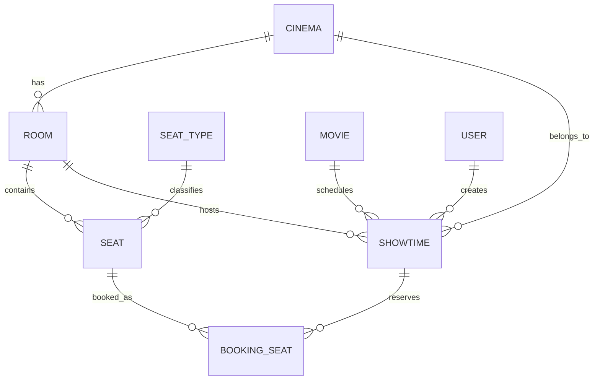

# API Documentation — Rooms, Seats & Showtimes

Tài liệu chi tiết cho FE: endpoint, request/response, **Business Rules (BR)**, cơ chế nghiệp vụ, và luồng tích hợp.

> **Base URL (local):** `http://localhost:5293`  
> **Swagger:** `http://localhost:5293/swagger`

---

## Mục lục

1. [Xác thực & phân quyền](#1-xác-thực--phân-quyền)
2. [Định dạng response chung](#2-định-dạng-response-chung)
3. [Quan hệ dữ liệu](#3-quan-hệ-dữ-liệu)
4. [Rooms API](#4-rooms-api-aprooms)
5. [Seats API](#5-seats-api-apiseats)
6. [Showtimes API](#6-showtimes-api-apishowtimes)
7. [Cơ chế sinh Seat Layout (chi tiết)](#7-cơ-chế-sinh-seat-layout-chi-tiết)
8. [Cơ chế kiểm tra trùng Showtime](#8-cơ-chế-kiểm-tra-trùng-showtime)
9. [Luồng nghiệp vụ gợi ý cho FE](#9-luồng-nghiệp-vụ-gợi-ý-cho-fe)
10. [Ví dụ JavaScript](#10-ví-dụ-javascript)
11. [Smoke test](#11-smoke-test)

---

## 1. Xác thực & phân quyền

Tất cả endpoint yêu cầu JWT:

```http
Authorization: Bearer <accessToken>
Content-Type: application/json
```

| Thao tác | Role |
|----------|------|
| `GET` | Bất kỳ user đã login |
| `POST` / `PUT` / `DELETE` | `Admin`, `Manager`, hoặc `Staff` |

Lấy token: `POST /api/auth/login`

---

## 2. Định dạng response chung

```json
{
  "isSuccess": true,
  "message": "Mô tả kết quả",
  "data": { },
  "errors": null
}
```

| HTTP | Khi nào |
|------|---------|
| `200` | Thành công (GET, PUT, DELETE; và `POST .../seat-layout`, `POST .../seats`) |
| `201` | Tạo mới thành công (`POST /api/rooms`, `POST /api/showtimes`) |
| `400` | Validation lỗi / `InvalidOperationException` (ví dụ room/seat type không tồn tại khi POST layout) |
| `401` | Chưa login / token hết hạn |
| `403` | Không đủ role |
| `404` | Không tìm thấy resource |
| `409` | Xung đột nghiệp vụ (trùng tên, trùng lịch, v.v.) |

**Phân trang** (`PagedResult`):

```json
{
  "items": [],
  "page": 1,
  "pageSize": 20,
  "totalCount": 100,
  "totalPages": 5
}
```

---

## 3. Quan hệ dữ liệu



**Lưu ý quan trọng cho FE:**

- Tạo **Room** chỉ tạo bản ghi phòng — **chưa có ghế**. Ghế phải sinh qua `POST /api/rooms/{id}/seat-layout` hoặc thêm từng ghế qua `POST /api/rooms/{id}/seats`.
- Tạo **Showtime** cần sẵn `Movie` + `Room`. `cinemaId` tự lấy từ room, FE **không cần gửi**.
- `totalCapacity` được **tự cập nhật** khi thêm/sửa/xóa ghế (qua SeatService). Tuy nhiên `PUT /api/rooms` vẫn cho phép admin **ghi đè thủ công** `totalCapacity` — lúc đó `totalCapacity` có thể **khác** `seatCount`.
- `seatTypeName` khớp **phân biệt hoa thường** với cột `SEAT_TYPES.name` (so khớp exact sau `Trim()`).

---

## 4. Rooms API (`/api/rooms`)

### 4.1. `GET /api/rooms` — Danh sách phòng

**Mục đích:** Tìm kiếm, lọc, phân trang danh sách phòng.

**Query params:**

| Param | Kiểu | Mô tả |
|-------|------|-------|
| `cinemaId` | guid? | Lọc theo rạp |
| `roomType` | string? | `STANDARD` \| `VIP` \| `IMAX` \| `4DX` |
| `status` | string? | `ACTIVE` \| `INACTIVE` \| `MAINTENANCE` |
| `keyword` | string? | Tìm trong: tên phòng, tên rạp, thành phố |
| `page` | int | Mặc định `1` |
| `pageSize` | int | Mặc định `20`, tối đa `100` |

**Business Rules:**

| ID | Rule |
|----|------|
| BR-R01 | Sắp xếp: theo `cinemaName` ASC, rồi `roomName` ASC |
| BR-R02 | `seatCount` = số ghế có `status = ACTIVE` trong phòng (không đếm ghế `DISABLED`) |
| BR-R03 | `totalCapacity` lấy từ DB — có thể khác `seatCount` nếu admin set thủ công khi tạo room hoặc chưa sync layout |

**Response field (`RoomResponse`):**

| Field | Kiểu | Ý nghĩa |
|-------|------|---------|
| `id` | guid | ID phòng |
| `cinemaId` | guid | ID rạp |
| `cinemaName` | string | Tên rạp |
| `name` | string | Tên phòng |
| `roomType` | string | Loại phòng |
| `totalCapacity` | int | Sức chứa (do hệ thống cập nhật khi quản lý ghế) |
| `status` | string | Trạng thái phòng |
| `seatCount` | int | Số ghế ACTIVE hiện tại |
| `createdAt` | datetime | Thời điểm tạo (UTC) |

---

### 4.2. `GET /api/rooms/{id}` — Chi tiết phòng

**Mục đích:** Lấy thông tin 1 phòng.

| ID | Rule |
|----|------|
| BR-R04 | Không tìm thấy → `404`, message `"Room not found."` |

---

### 4.3. `POST /api/rooms` — Tạo phòng

**Mục đích:** Tạo phòng chiếu mới trong một rạp.

> **Quan trọng:** API này **KHÔNG** tự sinh ghế. Sau khi tạo room, FE cần gọi tiếp `POST /api/rooms/{id}/seat-layout` để sinh sơ đồ ghế.

**Request body:**

```json
{
  "cinemaId": "guid",
  "name": "Room A1",
  "roomType": "STANDARD",
  "totalCapacity": 50
}
```

| Field | Bắt buộc | Validation | Mô tả |
|-------|----------|------------|-------|
| `cinemaId` | Có | guid không rỗng | Validator chỉ `NotEmpty`; **tồn tại trong `CINEMAS` được kiểm tra ở Service** |
| `name` | Có | max 50 ký tự | Unique trong cùng `cinemaId` |
| `roomType` | Có | `STANDARD` \| `VIP` \| `IMAX` \| `4DX` | |
| `totalCapacity` | Có | 1–1000 | Giá trị khởi tạo; sẽ được cập nhật lại khi sinh layout |

**Business Rules:**

| ID | Rule |
|----|------|
| BR-R05 | `cinemaId` không tồn tại → `400` `"Cinema not found."` |
| BR-R06 | Trùng `name` trong cùng rạp → `409` `"Room name already exists in this cinema."` |
| BR-R07 | `name` được `Trim()` trước khi lưu |
| BR-R08 | `status` mặc định = `ACTIVE` (FE không gửi) |
| BR-R09 | `createdAt` = `DateTime.UtcNow` |
| BR-R10 | Response `seatCount` = `0` (chưa có ghế) |

**Side effects:** Insert 1 row vào `ROOMS`. Không tạo `SEATS`.

**HTTP:** `201 Created` + `Location` header trỏ tới `GET /api/rooms/{id}`

---

### 4.4. `PUT /api/rooms/{id}` — Cập nhật phòng

**Request body:**

```json
{
  "name": "Room A1 VIP",
  "roomType": "VIP",
  "totalCapacity": 60,
  "status": "ACTIVE"
}
```

| Field | Bắt buộc | Giá trị |
|-------|----------|---------|
| `name` | Có | max 50 ký tự |
| `roomType` | Có | `STANDARD` \| `VIP` \| `IMAX` \| `4DX` |
| `totalCapacity` | Có | 1–1000 |
| `status` | Có | `ACTIVE` \| `INACTIVE` \| `MAINTENANCE` |

**Business Rules:**

| ID | Rule |
|----|------|
| BR-R11 | Không tìm thấy → `404` |
| BR-R12 | Trùng `name` với phòng khác cùng rạp → `409` |
| BR-R13 | Cập nhật `totalCapacity` **không** tự động thêm/xóa ghế — chỉ đổi field trên room |
| BR-R14 | `seatCount` trong response = đếm ghế ACTIVE thực tế |

---

### 4.5. `DELETE /api/rooms/{id}` — Xóa phòng

**Business Rules:**

| ID | Rule |
|----|------|
| BR-R15 | Không tìm thấy → `404` |
| BR-R16 | Phòng còn showtime có `status` **khác** `CANCELLED` và **khác** `COMPLETED` → `409` `"Room cannot be deleted because it still has active showtimes."` |
| BR-R17 | Có ghế đã từng có booking (`BOOKING_SEATS`) → `409`, kèm danh sách `seatLabel` bị khóa |
| BR-R18 | Xóa thành công: xóa tất cả ghế của phòng (nếu có) rồi xóa phòng (hard delete) |

---

### 4.6. `GET /api/rooms/{id}/seat-layout` — Xem sơ đồ ghế

**Mục đích:** Lấy toàn bộ ghế của phòng, nhóm theo hàng — dùng để render UI chọn ghế.

**Business Rules:**

| ID | Rule |
|----|------|
| BR-R19 | Không tìm thấy phòng → `404` (GET layout trả `null` từ service) |
| BR-R20 | Ghế sắp xếp: `rowLetter` ASC → `colNumber` ASC |
| BR-R21 | `totalSeats` = chỉ đếm ghế `status = ACTIVE` |
| BR-R22 | Response bao gồm cả ghế `DISABLED` trong mảng `rows` — FE cần disable UI cho ghế `DISABLED` |
| BR-R23 | Mỗi ghế kèm `seatTypeName` và `seatMultiplier` (hệ số giá) |

**Response structure:**

```json
{
  "roomId": "guid",
  "roomName": "Room A1",
  "totalSeats": 15,
  "rows": [
    {
      "rowLetter": "A",
      "seats": [
        {
          "id": "guid",
          "roomId": "guid",
          "seatLabel": "A1",
          "rowLetter": "A",
          "colNumber": 1,
          "seatTypeName": "Standard",
          "seatMultiplier": 1.0,
          "status": "ACTIVE"
        }
      ]
    }
  ]
}
```

---

### 4.7. `POST /api/rooms/{id}/seat-layout` — Sinh sơ đồ ghế hàng loạt

**Mục đích:** Tự động tạo ma trận ghế theo số hàng × số ghế/hàng, có hỗ trợ override vùng VIP.

> Xem [Mục 7](#7-cơ-chế-sinh-seat-layout-chi-tiết) để hiểu thuật toán đầy đủ.

**Request body:**

```json
{
  "rows": 5,
  "seatsPerRow": 10,
  "defaultSeatTypeName": "Standard",
  "replaceExisting": false,
  "overrides": [
    {
      "rowFrom": "A",
      "rowTo": "B",
      "colFrom": 1,
      "colTo": 3,
      "seatTypeName": "VIP",
      "status": "ACTIVE"
    }
  ]
}
```

| Field | Bắt buộc | Validation |
|-------|----------|------------|
| `rows` | Có | 1–26 (tương ứng hàng A–Z) |
| `seatsPerRow` | Có | 1–50 |
| `defaultSeatTypeName` | Có | Tên phải tồn tại trong `SEAT_TYPES` và `status = ACTIVE` |
| `replaceExisting` | Không | boolean, **mặc định `false`** nếu không gửi |
| `overrides` | Không | Mảng vùng ghi đè (xem BR-R30–BR-R35) |

**HTTP response:** `200 OK` (không phải `201`).

**Business Rules:**

| ID | Rule |
|----|------|
| BR-R24 | Phòng không tồn tại → `400` `"Room not found."` (`InvalidOperationException` — **khác** GET layout dùng `404`) |
| BR-R25 | `replaceExisting = false` và phòng **đã có ghế** → `409` `"Room already has seats. Set ReplaceExisting=true to regenerate layout."` |
| BR-R26 | `replaceExisting = true` và có ghế đã từng booking → `409`, liệt kê `seatLabel` không thể thay thế |
| BR-R27 | `replaceExisting = true` và không có booking → **xóa toàn bộ ghế cũ** rồi tạo mới |
| BR-R28 | `defaultSeatTypeName` / `override.seatTypeName` không tồn tại hoặc inactive → `400` `"Seat type is not available."` |
| BR-R29 | Sau khi sinh: `room.totalCapacity` = số ghế mới có `status = ACTIVE` |
| BR-R30 | Override `rowFrom`/`rowTo` phải nằm trong phạm vi hàng được sinh (A → A+rows-1) |
| BR-R31 | Override `colTo` không được vượt `seatsPerRow` |
| BR-R32 | Override `colFrom` ≤ `colTo`, `rowFrom` ≤ `rowTo` |
| BR-R33 | Nhiều override chồng nhau → **override sau cùng trong mảng thắng** (`LastOrDefault`) |
| BR-R34 | Ghế không nằm trong override → dùng `defaultSeatTypeName`, `status = ACTIVE` |
| BR-R35 | Ghế trong override không gửi `status` → mặc định `ACTIVE` |
| BR-R36 | Tổng ghế sinh ra = `rows × seatsPerRow` (tối đa 26×50 = 1300) |
| BR-R37 | `seatLabel` = `{RowLetter}{ColNumber}` ví dụ `A1`, `B10` — unique trong phòng |

**Side effects:**

1. Có thể xóa ghế cũ (nếu `replaceExisting=true`)
2. Insert `rows × seatsPerRow` records vào `SEATS`
3. Cập nhật `ROOMS.total_capacity`

---

### 4.8. `POST /api/rooms/{id}/seats` — Tạo ghế đơn lẻ

**Mục đích:** Thêm 1 ghế vào phòng đã có layout (hoặc phòng trống).

> **Không có** `POST /api/seats` — route tạo ghế luôn nằm dưới room.

**Request body:**

```json
{
  "rowLetter": "D",
  "colNumber": 1,
  "seatTypeName": "Standard"
}
```

| Field | Validation |
|-------|------------|
| `rowLetter` | 1 chữ cái A–Z (không phân biệt hoa thường, lưu UPPERCASE) |
| `colNumber` | 1–255 |
| `seatTypeName` | Phải tồn tại và ACTIVE |

**Business Rules:**

| ID | Rule |
|----|------|
| BR-R38 | Phòng không tồn tại → `400` (`InvalidOperationException`) |
| BR-R39 | `seatLabel` = `{rowLetter}{colNumber}` đã tồn tại → `409` `"Seat label already exists in this room."` |
| BR-R40 | Ghế mới luôn `status = ACTIVE` |
| BR-R41 | `room.totalCapacity` = đếm ghế ACTIVE hiện có trong phòng **+ 1** (ghế mới), ghi đè giá trị cũ |

**HTTP response:** `200 OK`.

---

## 5. Seats API (`/api/seats`)

Route độc lập chỉ cho **cập nhật** và **xóa** ghế đã tồn tại.

### 5.1. `PUT /api/seats/{id}` — Cập nhật ghế

**Request body:**

```json
{
  "seatTypeName": "VIP",
  "status": "ACTIVE"
}
```

| Field | Bắt buộc | Mô tả |
|-------|----------|-------|
| `seatTypeName` | Không | Bỏ qua nếu không gửi — giữ loại ghế cũ |
| `status` | Có* | `ACTIVE` \| `DISABLED` — DTO có default `"ACTIVE"` nếu JSON không gửi field này |

**Business Rules:**

| ID | Rule |
|----|------|
| BR-S01 | Không tìm thấy → `404` `"Seat not found."` |
| BR-S02 | `seatTypeName` gửi lên nhưng không tồn tại/inactive → `400` |
| BR-S03 | Sau update: `room.totalCapacity` = đếm lại tất cả ghế ACTIVE trong phòng |
| BR-S04 | Disable ghế (`status = DISABLED`) → ghế vẫn còn DB, không hiển thị trong `totalSeats` của layout |

---

### 5.2. `DELETE /api/seats/{id}` — Xóa ghế

**Business Rules:**

| ID | Rule | Kết quả |
|----|------|---------|
| BR-S05 | Không tìm thấy | `404` |
| BR-S06 | Ghế **chưa từng** có booking | **Hard delete** — xóa khỏi DB |
| BR-S07 | Ghế **đã có** booking history | **Soft delete** — `status → DISABLED`, không xóa record |
| BR-S08 | Sau xóa/disable: cập nhật `room.totalCapacity` | |

**Message khi soft delete:**

```json
{
  "isSuccess": true,
  "message": "Seat disabled because it has booking history.",
  "data": null
}
```

---

## 6. Showtimes API (`/api/showtimes`)

### 6.1. `GET /api/showtimes` — Danh sách lịch chiếu

**Query params:**

| Param | Mô tả |
|-------|-------|
| `movieId` | Lọc theo phim |
| `cinemaId` | Lọc theo rạp |
| `roomId` | Lọc theo phòng |
| `dateFrom` | `startTime >= dateFrom` |
| `dateTo` | `startTime <= dateTo` |
| `status` | `SCHEDULED` \| `ACTIVE` \| `COMPLETED` \| `CANCELLED` |
| `page`, `pageSize` | Phân trang |

**Business Rules:**

| ID | Rule |
|----|------|
| BR-ST01 | Sắp xếp `startTime` ASC |
| BR-ST02 | Response enrich: `movieTitle`, `roomName`, `cinemaName` |

---

### 6.2. `GET /api/showtimes/{id}` — Chi tiết

| ID | Rule |
|----|------|
| BR-ST03 | Không tìm thấy → `404` `"Showtime not found."` |

---

### 6.3. `POST /api/showtimes` — Tạo lịch chiếu

**Request body:**

```json
{
  "movieId": "guid",
  "roomId": "guid",
  "startTime": "2026-06-18T14:00:00",
  "endTime": null,
  "timeSlot": "AFTERNOON",
  "languageType": "SUBTITLED"
}
```

| Field | Bắt buộc | Mô tả |
|-------|----------|-------|
| `movieId` | Có | Phim phải tồn tại |
| `roomId` | Có | Phòng phải tồn tại |
| `startTime` | Có | Thời gian bắt đầu chiếu |
| `endTime` | Không | Xem BR-ST04 |
| `timeSlot` | Có | `MORNING` \| `AFTERNOON` \| `EVENING` \| `MIDNIGHT` \| `PEAK` |
| `languageType` | Có | `DUBBED` \| `SUBTITLED` |

**Business Rules:**

| ID | Rule |
|----|------|
| BR-ST04 | Không gửi `endTime` → tự tính: `endTime = startTime + movie.durationMin + 15 phút` |
| BR-ST05 | `endTime` phải > `startTime` → nếu không `400` |
| BR-ST06 | `cinemaId` **tự gán** = `room.cinemaId` — FE không gửi |
| BR-ST07 | `createdBy` **tự gán** = user ID từ JWT claim |
| BR-ST08 | `status` mặc định = `SCHEDULED` |
| BR-ST09 | `createdAt` = UTC now |
| BR-ST10 | Kiểm tra overlap — xem [Mục 8](#8-cơ-chế-kiểm-tra-trùng-showtime) |
| BR-ST11 | `movieId` không tồn tại → `400` `"Movie not found."` (kiểm tra ở **Service**, validator chỉ `NotEmpty`) |
| BR-ST12 | `roomId` không tồn tại → `400` `"Room not found."` (kiểm tra ở **Service**) |
| BR-ST13 | Trùng lịch cùng phòng → `409` `"Showtime overlaps with an existing showtime in the same room."` |

**Ví dụ tính endTime:**

- Phim dài 120 phút, `startTime = 14:00`, không gửi `endTime`
- → `endTime = 14:00 + 120 + 15 = 16:15`

---

### 6.4. `PUT /api/showtimes/{id}` — Cập nhật (partial update)

**Request body** — chỉ gửi field cần đổi:

```json
{
  "startTime": "2026-06-18T15:00:00",
  "timeSlot": "EVENING",
  "languageType": "DUBBED"
}
```

| Field | Ghi chú |
|-------|---------|
| `startTime` | Tùy chọn |
| `endTime` | Tùy chọn |
| `timeSlot` | Tùy chọn — chỉ validate khi có gửi |
| `languageType` | Tùy chọn |
| `status` | Tùy chọn — `SCHEDULED` \| `ACTIVE` \| `COMPLETED` \| `CANCELLED` |

**Business Rules:**

| ID | Rule |
|----|------|
| BR-ST14 | Không tìm thấy → `404` |
| BR-ST15 | **Partial update** — field không gửi giữ nguyên giá trị cũ |
| BR-ST16 | Không gửi `status` → không đổi status (không bắt buộc gửi) |
| BR-ST17 | Đổi `startTime` mà không gửi `endTime` → giữ nguyên **độ dài** suất chiếu: `endTime = newStart + (oldEnd - oldStart)` |
| BR-ST18 | `endTime` phải > `startTime` |
| BR-ST19 | Kiểm tra overlap (loại trừ chính showtime đang sửa) |
| BR-ST20 | Trùng lịch → `409` |

---

### 6.5. `DELETE /api/showtimes/{id}` — Xóa / hủy lịch chiếu

**Business Rules:**

| ID | Rule | Hành vi |
|----|------|---------|
| BR-ST21 | Không tìm thấy | `404` |
| BR-ST22 | Chưa có booking (`BOOKING_SEATS`) | **Hard delete** |
| BR-ST23 | Đã có booking | **Soft cancel** — `status → CANCELLED`, giữ record |

**Message khi soft cancel:**

```json
{
  "isSuccess": true,
  "message": "Showtime cancelled because it has booking history.",
  "data": null
}
```

---

## 7. Cơ chế sinh Seat Layout (chi tiết)

Đây là thuật toán backend thực thi khi gọi `POST /api/rooms/{id}/seat-layout`.

### 7.1. Tổng quan luồng

```
1. Kiểm tra phòng tồn tại
2. Resolve defaultSeatTypeName → SeatType record
3. Kiểm tra replaceExisting / ghế cũ / booking history
4. (Tuỳ chọn) Xóa toàn bộ ghế cũ
5. Vòng lặp sinh ghế: rows × seatsPerRow
6. Áp dụng override cho từng ô
7. Lưu DB + cập nhật room.totalCapacity
8. Trả về layout qua GET logic
```

### 7.2. Cách đặt tên hàng và cột

| Thành phần | Công thức | Ví dụ (`rows=3`, `seatsPerRow=5`) |
|------------|-----------|-----------------------------------|
| Hàng | `rowIndex` 0→N-1 → chữ `A + rowIndex` | A, B, C |
| Cột | 1 → `seatsPerRow` | 1, 2, 3, 4, 5 |
| `seatLabel` | `{rowLetter}{colNumber}` | A1, A2, …, C5 |
| `rowLetter` | Uppercase 1 ký tự | A, B, C |
| `colNumber` | byte 1–50 | 1–5 |

**Sơ đồ minh họa** (`rows=3`, `seatsPerRow=5`, không override):

```
        [MÀN HÌNH]
   1   2   3   4   5
A  A1  A2  A3  A4  A5
B  B1  B2  B3  B4  B5
C  C1  C2  C3  C4  C5
```

### 7.3. Cơ chế Override (vùng ghi đè)

Mỗi phần tử `overrides[]` định nghĩa một **hình chữ nhật** trên ma trận ghế:

```
rowFrom ≤ row ≤ rowTo
colFrom ≤ col ≤ colTo
```

**Ví dụ:** VIP cho 2 hàng đầu, 3 cột đầu:

```json
{
  "rowFrom": "A", "rowTo": "B",
  "colFrom": 1, "colTo": 3,
  "seatTypeName": "VIP",
  "status": "ACTIVE"
}
```

```
   1    2    3    4    5
A  VIP  VIP  VIP  STD  STD
B  VIP  VIP  VIP  STD  STD
C  STD  STD  STD  STD  STD
```

**Quy tắc ưu tiên khi nhiều override chồng nhau:**

- Duyệt `overrides.LastOrDefault(rule => seat nằm trong vùng rule)`
- **Phần tử cuối cùng trong mảng `overrides` thắng**

Ví dụ 2 override chồng ô B2:

```json
"overrides": [
  { "rowFrom": "A", "rowTo": "C", "colFrom": 1, "colTo": 5, "seatTypeName": "Standard" },
  { "rowFrom": "B", "rowTo": "B", "colFrom": 2, "colTo": 2, "seatTypeName": "VIP" }
]
```

→ Ô B2 = VIP (override thứ 2 thắng).

### 7.4. `replaceExisting` — Khi nào dùng?

| Tình huống | `replaceExisting` | Kết quả |
|------------|-------------------|---------|
| Phòng mới tạo, chưa có ghế | `false` | Sinh ghế bình thường |
| Phòng đã có ghế, muốn thiết kế lại | `true` | Xóa ghế cũ → sinh mới |
| Phòng đã có ghế, gọi với `false` | — | **409** lỗi |
| Ghế cũ đã có booking, `true` | — | **409** — không cho thay thế |

### 7.5. Ràng buộc validation override

| Kiểm tra | Lỗi khi |
|----------|---------|
| `rowFrom` ≤ `rowTo` | `rowFrom > rowTo` |
| Hàng nằm trong layout | `rowFrom < A` hoặc `rowTo > hàng cuối` |
| `colFrom` ≤ `colTo` | `colFrom > colTo` |
| Cột nằm trong layout | `colTo > seatsPerRow` |

### 7.6. Sau khi sinh layout

- `room.totalCapacity` = số ghế có `status = ACTIVE` trong batch vừa sinh
- FE nên gọi `GET /api/rooms/{id}/seat-layout` để render (hoặc dùng response trả về từ POST)
- Có thể bổ sung ghế lẻ sau bằng `POST /api/rooms/{id}/seats` (ví dụ hàng D)

---

## 8. Cơ chế kiểm tra trùng Showtime

Hai showtime **bị coi là trùng** khi **cùng `roomId`** và thỏa:

```
showtimeA.startTime < showtimeB.endTime
AND
showtimeA.endTime > showtimeB.startTime
```

(Tức là hai khoảng thời gian có giao nhau.)

**Bỏ qua** showtime có `status = CANCELLED` khi kiểm tra.

**Minh họa:**

```
Room A:
  Showtime 1: |----14:00========16:15----|
  Showtime 2:          |--15:00====17:00--|  → TRÙNG (409)
  Showtime 3:                              |--17:00====19:00--|  → OK
  Showtime 4 (CANCELLED): |--13:00====15:00--|  → BỎ QUA khi check
```

Khi **update** showtime: loại trừ chính record đang sửa khỏi phép kiểm tra.

---

## 9. Luồng nghiệp vụ gợi ý cho FE

### 9.1. Admin — Thiết lập phòng mới (end-to-end)

```
Bước 1: POST /api/rooms
        → Nhận roomId, seatCount=0

Bước 2: POST /api/rooms/{roomId}/seat-layout
        Body: { rows, seatsPerRow, defaultSeatTypeName, replaceExisting: false }
        → Nhận layout đầy đủ

Bước 3 (tuỳ chọn): POST /api/rooms/{roomId}/seats
        → Thêm ghế đặc biệt (hàng D, ghế đôi, v.v.)

Bước 4: GET /api/rooms/{roomId}/seat-layout
        → Render preview cho admin xác nhận
```

### 9.2. Admin — Thiết kế lại layout phòng đã có

```
1. Kiểm tra phòng chưa có booking trên ghế cũ
2. POST /api/rooms/{id}/seat-layout với replaceExisting: true
3. Nếu 409 (có booking history) → báo admin, không cho regenerate
```

### 9.3. Admin — Tạo lịch chiếu

```
1. GET /api/movies (module khác) → chọn movieId
2. GET /api/rooms?cinemaId=... → chọn roomId
3. POST /api/showtimes { movieId, roomId, startTime, timeSlot, languageType }
4. Nếu 409 overlap → hiển thị lỗi, đề xuất chọn giờ khác
```

### 9.4. Customer — Chọn ghế (tương lai)

```
1. GET /api/showtimes?movieId=...&dateFrom=hôm nay
2. GET /api/showtimes/{id} → lấy roomId, startTime
3. GET /api/rooms/{roomId}/seat-layout → render ghế
4. Ghế DISABLED → hiển thị không chọn được
5. Module booking (chưa có) → lock ghế qua BOOKING_SEATS
```

---

## 10. Ví dụ JavaScript

### Tạo phòng + sinh layout

```javascript
const BASE = "http://localhost:5293";
const headers = {
  "Content-Type": "application/json",
  Authorization: `Bearer ${token}`,
};

// Bước 1: Tạo room
const roomRes = await fetch(`${BASE}/api/rooms`, {
  method: "POST",
  headers,
  body: JSON.stringify({
    cinemaId: "your-cinema-guid",
    name: "Room A1",
    roomType: "STANDARD",
    totalCapacity: 50,
  }),
}).then((r) => r.json());

if (!roomRes.isSuccess) throw new Error(roomRes.message);
const roomId = roomRes.data.id;

// Bước 2: Sinh layout 5 hàng × 10 ghế, hàng A-B cột 1-3 là VIP
const layoutRes = await fetch(`${BASE}/api/rooms/${roomId}/seat-layout`, {
  method: "POST",
  headers,
  body: JSON.stringify({
    rows: 5,
    seatsPerRow: 10,
    defaultSeatTypeName: "Standard",
    replaceExisting: false,
    overrides: [
      {
        rowFrom: "A",
        rowTo: "B",
        colFrom: 1,
        colTo: 3,
        seatTypeName: "VIP",
        status: "ACTIVE",
      },
    ],
  }),
}).then((r) => r.json());

console.log(layoutRes.data.totalSeats); // 50
console.log(layoutRes.data.rows);       // ma trận ghế
```

### Tạo showtime

```javascript
const showRes = await fetch(`${BASE}/api/showtimes`, {
  method: "POST",
  headers,
  body: JSON.stringify({
    movieId: "movie-guid",
    roomId: roomId,
    startTime: "2026-06-18T14:00:00",
    timeSlot: "AFTERNOON",
    languageType: "SUBTITLED",
    // endTime bỏ trống → backend tự tính
  }),
}).then((r) => r.json());

console.log(showRes.data.endTime); // startTime + duration + 15min
```

### Partial update showtime

```javascript
// Chỉ đổi khung giờ và ngôn ngữ — KHÔNG cần gửi status
await fetch(`${BASE}/api/showtimes/${showId}`, {
  method: "PUT",
  headers,
  body: JSON.stringify({
    timeSlot: "EVENING",
    languageType: "DUBBED",
  }),
});
```

---

## 11. Smoke test

```powershell
# Terminal 1
cd cinema-system-be/src/CinemaSystem.API
dotnet run --launch-profile http

# Terminal 2
powershell -ExecutionPolicy Bypass -File cinema-system-be/scripts/test-room-seat-showtime.ps1
```

Kết quả mong đợi: **18/18 PASS**.

---

## Phụ lục A — Bảng enum đầy đủ

### Room

| Field | Giá trị hợp lệ |
|-------|----------------|
| `roomType` | `STANDARD`, `VIP`, `IMAX`, `4DX` |
| `status` | `ACTIVE`, `INACTIVE`, `MAINTENANCE` |

### Seat

| Field | Giá trị hợp lệ |
|-------|----------------|
| `status` | `ACTIVE`, `DISABLED` |

### Showtime

| Field | Giá trị hợp lệ |
|-------|----------------|
| `timeSlot` | `MORNING`, `AFTERNOON`, `EVENING`, `MIDNIGHT`, `PEAK` |
| `languageType` | `DUBBED`, `SUBTITLED` |
| `status` | `SCHEDULED`, `ACTIVE`, `COMPLETED`, `CANCELLED` |

---

## Phụ lục B — Phụ thuộc dữ liệu (prerequisites)

| API | Cần có sẵn trong DB |
|-----|---------------------|
| `POST /api/rooms` | `CINEMAS` record (`cinemaId`) |
| `POST seat-layout` / `POST seats` | `SEAT_TYPES` record — `name` **khớp chính xác** (case-sensitive), `status = ACTIVE` |
| `POST /api/showtimes` | `MOVIES` + `ROOMS` record |

> Module quản lý Cinema / SeatType có thể chưa có public API — liên hệ team BE hoặc seed qua DB.

---

## Phụ lục C — Tổng hợp Business Rules theo mã

| Mã | Endpoint | Tóm tắt |
|----|----------|---------|
| BR-R01–R03 | GET rooms | Sort, đếm seatCount |
| BR-R05–R10 | POST room | Validate cinema, unique name, status ACTIVE |
| BR-R11–R14 | PUT room | Unique name, không auto-sync ghế |
| BR-R15–R18 | DELETE room | Chặn nếu active showtime / booking |
| BR-R19–R23 | GET layout | Nhóm theo hàng, đếm ACTIVE |
| BR-R24–R37 | POST layout | Thuật toán sinh ghế + override |
| BR-R38–R41 | POST seat | Unique seatLabel, tăng capacity |
| BR-S01–S08 | Seats API | Update/disable/delete logic |
| BR-ST04–ST13 | POST showtime | Auto endTime, overlap check |
| BR-ST14–ST20 | PUT showtime | Partial update, giữ duration |
| BR-ST21–ST23 | DELETE showtime | Hard delete vs soft cancel |

---

## Phụ lục D — Đối chiếu code (nguồn sự thật)

Tài liệu được viết dựa trực tiếp trên các file sau (không suy diễn thêm):

| Thành phần | File |
|------------|------|
| Controllers | `CinemaSystem.API/Controllers/RoomsController.cs`, `SeatsController.cs`, `ShowtimesController.cs` |
| Business logic | `CinemaSystem.Services/Services/Rooms/RoomService.cs`, `SeatService.cs`, `Showtimes/ShowtimeService.cs` |
| Overlap check | `CinemaSystem.DAL/Repository/Showtimes/ShowtimeRepository.cs` → `HasOverlappingShowtimeAsync` |
| DTO / enum | `CinemaSystem.Common/DTOs/Rooms/RoomDtos.cs`, `Showtimes/ShowtimeDtos.cs` |
| Validation | `CinemaSystem.API/Validators/Rooms/*`, `Validators/Showtimes/*` |
| Error messages | `CinemaSystem.Common/Constants/RoomMessages.cs`, `ShowtimeMessages.cs` |
| Exception → HTTP | `CinemaSystem.API/Middleware/GlobalExceptionMiddleware.cs` |

### Điểm đã sửa sau khi đối chiếu lại

| Trước (sai / thiếu) | Sau (đúng code) |
|---------------------|-----------------|
| `replaceExisting` bắt buộc gửi | Mặc định `false`, không bắt buộc |
| `POST seat-layout` / `POST seats` trả `201` | Trả **`200 OK`** (`return Ok(...)`) |
| Room không tồn tại luôn `404` | GET layout → `404`; POST layout / POST seat → `400` |
| `cinemaId` validate tồn tại ở validator | Validator chỉ `NotEmpty`; **Service** gọi `cinemaRepository.ExistsAsync` |
| `seatTypeName` không nhắc case | So khớp **exact** (case-sensitive) sau `Trim()` |
| `totalCapacity` luôn auto-sync | Auto-sync khi thao tác ghế; **PUT room** vẫn ghi đè thủ công được |
