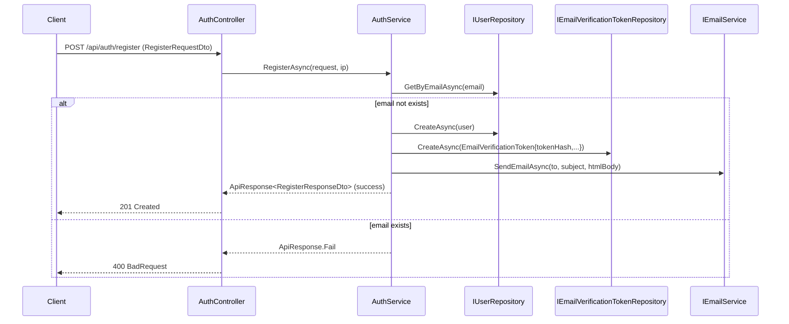
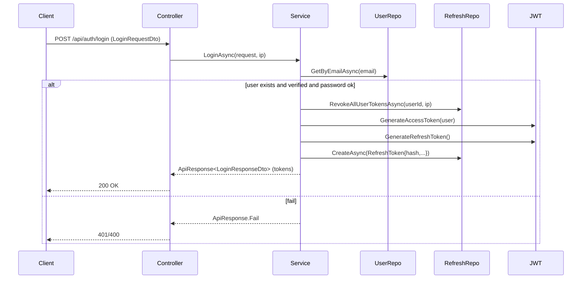
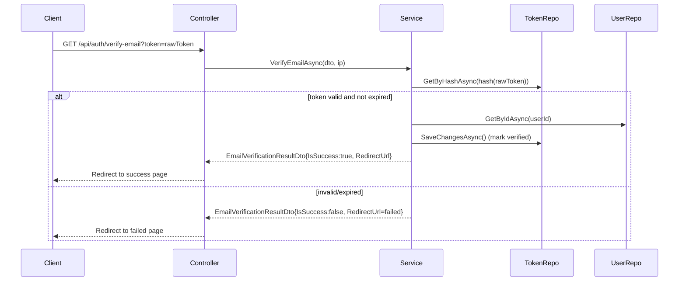

# Luồng hoạt động chi tiết: Login, Register và Email Verify

Tài liệu này mô tả chi tiết luồng chạy (sequence) giữa các lớp, package và endpoint liên quan tới đăng ký (register), đăng nhập (login) và xác thực email (email verification) trong hệ thống.

## File chính tham chiếu

- [src/CinemaSystem.API/Controllers/AuthController.cs](src/CinemaSystem.API/Controllers/AuthController.cs)
- [src/CinemaSystem.Services/Services/Auth/AuthService.cs](src/CinemaSystem.Services/Services/Auth/AuthService.cs)
- [src/CinemaSystem.Services/Services/Auth/IAuthService.cs](src/CinemaSystem.Services/Services/Auth/IAuthService.cs)
- [src/CinemaSystem.Common/Services/IEmailService.cs](src/CinemaSystem.Common/Services/IEmailService.cs)
- [src/CinemaSystem.API/Services/EmailService.cs](src/CinemaSystem.API/Services/EmailService.cs)
- [src/CinemaSystem.Common/DTOs/Auth/AuthResponseDto.cs](src/CinemaSystem.Common/DTOs/Auth/AuthResponseDto.cs)

---

## Tổng quan các package và responsibility

- CinemaSystem.API
  - Chứa `AuthController` chịu trách nhiệm nhận request HTTP (register, login, verify-email, refresh-token, resend-verification).
  - [AuthController](src/CinemaSystem.API/Controllers/AuthController.cs) gọi `IAuthService` để xử lý nghiệp vụ.
- CinemaSystem.Services
  - Chứa `AuthService : IAuthService` (cụ thể [AuthService](src/CinemaSystem.Services/Services/Auth/AuthService.cs)).
  - `AuthService` xử lý logic đăng ký, đăng nhập, tạo token, lưu refresh token, tạo email verification token, và gửi email.
- CinemaSystem.DAL
  - Chứa các repository (e.g., `IUserRepository`, `IRefreshTokenRepository`, `IEmailVerificationTokenRepository`) để thao tác DB với `User`, `RefreshToken`, `EmailVerificationToken`.
- CinemaSystem.Common
  - Chứa DTOs (request/response) và interface service chung như `IEmailService`.
- CinemaSystem.API.Services
  - Cài đặt `IEmailService` bằng SMTP trong [EmailService](src/CinemaSystem.API/Services/EmailService.cs).

---

## Luồng chi tiết: Register

1. Client POST `/api/auth/register` với `RegisterRequestDto` → `AuthController.Register`.
2. `AuthController` gọi `_authService.RegisterAsync(request, clientIp)`.
3. `AuthService.RegisterAsync`:
   - Kiểm tra tồn tại email: `_userRepository.GetByEmailAsync(email)`.
   - Nếu chưa tồn tại: hash password (BCrypt), tạo `User` và `CreateAsync(user)` vào DB.
   - Tạo raw token bằng `CreateRawToken()` → hash bằng `TokenHashHelper.Sha256(rawToken)`.
   - Lưu `EmailVerificationToken` vào `_emailVerificationTokenRepository.CreateAsync(...)` với `TokenHash`, `ExpiresAt`.
   - Gọi `SendVerificationEmailAsync(email, fullName, rawToken)` để gửi email:
     - `SendVerificationEmailAsync` dựng link bằng `BuildVerificationLink(rawToken)`.
     - Tạo body HTML bằng `VerificationEmailTemplate.Build(...)`.
     - Gọi `_emailService.SendEmailAsync(to, subject, htmlBody)` (`IEmailService`), cài đặt SMTP trong [EmailService](src/CinemaSystem.API/Services/EmailService.cs).
   - Trả về `ApiResponse<RegisterResponseDto>` chứa thông tin user và `EmailVerificationExpiresAt`.

Sequence diagram (register):

---

## Luồng chi tiết: Login

1. Client POST `/api/auth/login` với `LoginRequestDto` → `AuthController.Login`.
2. `AuthController` gọi `_authService.LoginAsync(request, clientIp)`.
3. `AuthService.LoginAsync`:
   - Lấy `User` bằng `_userRepository.GetByEmailAsync(email)`.
   - Kiểm tra `Status == ACTIVE` và `IsEmailVerified == true`.
   - Kiểm tra password bằng `BCrypt.Verify(...)`.
   - Nếu success:
     - Reset `FailedLoginCount`, cập nhật `LastLogin`, lưu user.
     - Revoke tất cả refresh token của user hiện có: `_refreshTokenRepository.RevokeAllUserTokensAsync(user.Id, clientIp)`.
     - Tạo token pair (`CreateTokenPairAsync`):
       - `accessToken = _jwtService.GenerateAccessToken(user)`
       - `refreshToken = _jwtService.GenerateRefreshToken()`
       - Lưu hash refresh token vào `_refreshTokenRepository.CreateAsync(...)`.
     - Trả về `ApiResponse<LoginResponseDto>` với `AccessToken`, `RefreshToken`, `AccessTokenExpiresAt`.
   - Nếu fail: trả lỗi tương ứng (401 / message).

Sequence diagram (login):

---

## Luồng chi tiết: Email Verification

Có hai dạng: verify qua GET link (click link trong email) và verify qua POST (API client gửi token).

1. Client (browser) GET `/api/auth/verify-email?token=...` → `AuthController.VerifyEmailGet`:
   - Controller dựng `VerifyEmailRequestDto` rồi gọi `_authService.VerifyEmailAsync(dto, clientIp)`.
   - `AuthService.VerifyEmailAsync`:
     - Nếu token trống -> trả `Invalid` → redirect failure URL.
     - Hash token bằng `TokenHashHelper.Sha256(token)`.
     - Lấy `EmailVerificationToken` bằng `_emailVerificationTokenRepository.GetByHashAsync(tokenHash)`.
     - Kiểm tra `IsVerified`, `ExpiresAt`.
     - Lấy `User` tương ứng, set `user.IsEmailVerified = true`, `verificationToken.IsVerified = true`, lưu changes.
     - Trả `EmailVerificationResultDto` với `IsSuccess=true` và `RedirectUrl` (success URL).
   - `AuthController.VerifyEmailGet` redirect tới `response.RedirectUrl`.

2. Client POST `/api/auth/verify-email` với `{ token }` → `AuthController.VerifyEmail` (tương tự xử lý và trả JSON với kết quả).

3. Resend verification: POST `/api/auth/resend-verification` với `{ email }`:
   - `AuthService.ResendVerificationAsync` kiểm tra user tồn tại và chưa verified.
   - Invalidate token cũ nếu còn tồn tại: `_emailVerificationTokenRepository.InvalidateUnverifiedTokensAsync(user.Id)`.
   - Tạo token mới, lưu, gửi email bằng `_emailService.SendEmailAsync(...)`.

Sequence diagram (verify via link):

---

## Các class/method chính liên quan

- `AuthController` ([src/CinemaSystem.API/Controllers/AuthController.cs](src/CinemaSystem.API/Controllers/AuthController.cs))
  - `Register`, `Login`, `RefreshToken`, `VerifyEmail` (POST), `VerifyEmailGet` (GET), `ResendVerification`.
- `AuthService` ([src/CinemaSystem.Services/Services/Auth/AuthService.cs](src/CinemaSystem.Services/Services/Auth/AuthService.cs))
  - `RegisterAsync`, `LoginAsync`, `RefreshTokenAsync`, `VerifyEmailAsync`, `ResendVerificationAsync`.
  - Helpers: `CreateTokenPairAsync`, `RotateTokenPairAsync`, `SendVerificationEmailAsync`, `BuildVerificationLink`, `CreateRawToken`.
- Repositories (DAL): `IUserRepository`, `IRefreshTokenRepository`, `IEmailVerificationTokenRepository` (lưu/đọc các entity `User`, `RefreshToken`, `EmailVerificationToken`).
- `IEmailService` ([src/CinemaSystem.Common/Services/IEmailService.cs](src/CinemaSystem.Common/Services/IEmailService.cs)) và `EmailService` implementation ([src/CinemaSystem.API/Services/EmailService.cs](src/CinemaSystem.API/Services/EmailService.cs)).
- `IJwtService` (không liệt kê ở đây chi tiết, chịu trách nhiệm generate access/refresh tokens).

---

## Lưu ý vận hành và bảo mật

- Refresh token được lưu dưới dạng hash (`TokenHashHelper.Sha256`) trong DB — raw token không lưu.
- Email verification token cũng lưu dưới dạng hash giống refresh token.
- Khi phát hiện refresh token bị reuse (`IsRevoked==true`), hệ thống revoke tất cả token user và yêu cầu login lại.
- Token raw được tạo bằng `RandomNumberGenerator.GetBytes(64)` và base64-safe encoding.
- Email gửi qua SMTP — kiểm tra `Smtp` config trong `appsettings`.
- Thời hạn verification token được cấu hình (mặc định cài trong `AuthService` các hằng số / config keys).

---

## Quick reference (tóm tắt đường đi của một request Register -> Verify)

1. Client -> `POST /api/auth/register` -> `AuthController.Register` -> `AuthService.RegisterAsync`
2. `AuthService` tạo `User`, lưu, tạo `EmailVerificationToken` (hash), gửi email bằng `_emailService.SendEmailAsync`.
3. Người dùng click link -> `GET /api/auth/verify-email?token=rawToken` -> `AuthController.VerifyEmailGet` -> `AuthService.VerifyEmailAsync`
4. `AuthService` hash token, lấy token record, mark verified, cập nhật user.IsEmailVerified -> redirect success.

---

## Gợi ý kiểm tra nhanh

- Kiểm tra `appsettings` cho `Smtp` và `App:FrontendBaseUrl` / `App:EmailVerificationSuccessUrl` / `App:EmailVerificationFailedUrl`.
- Kiểm tra kho lưu token: `IEmailVerificationTokenRepository` và thời gian `ExpiresAt`.
- Để debug, xem log tại `AuthService` (logger thông tin khi gửi email).

---

Nếu bạn muốn, tôi có thể:

- Thêm sơ đồ sequence chi tiết hơn cho từng bước nội bộ repository.
- Tạo sơ đồ ER nhỏ cho `EmailVerificationToken` / `RefreshToken`.
- Ghi thêm ví dụ payload của các DTO request/response.
